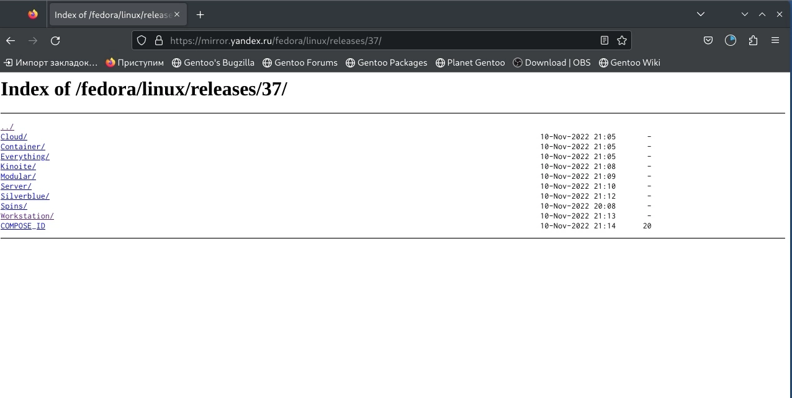
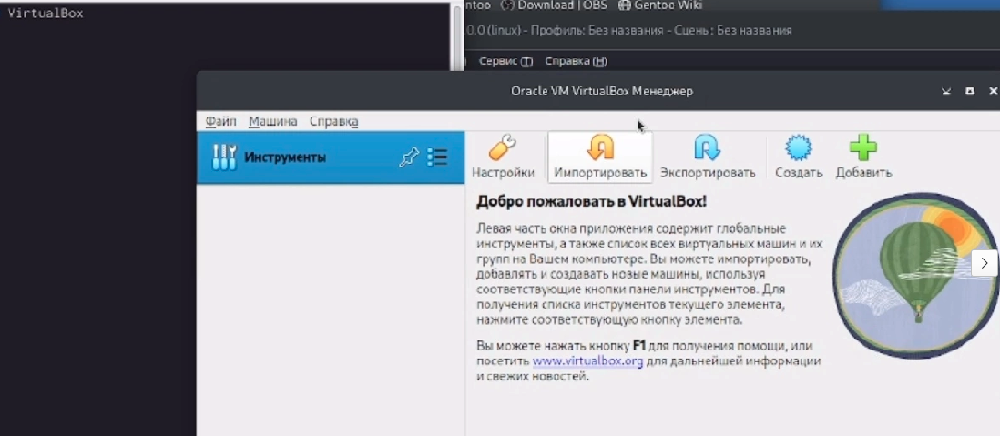
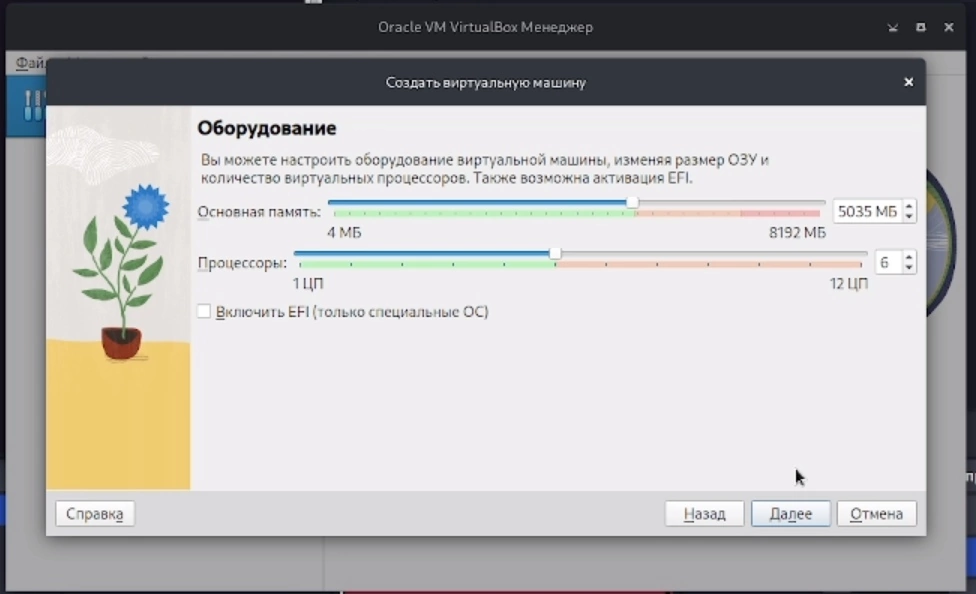
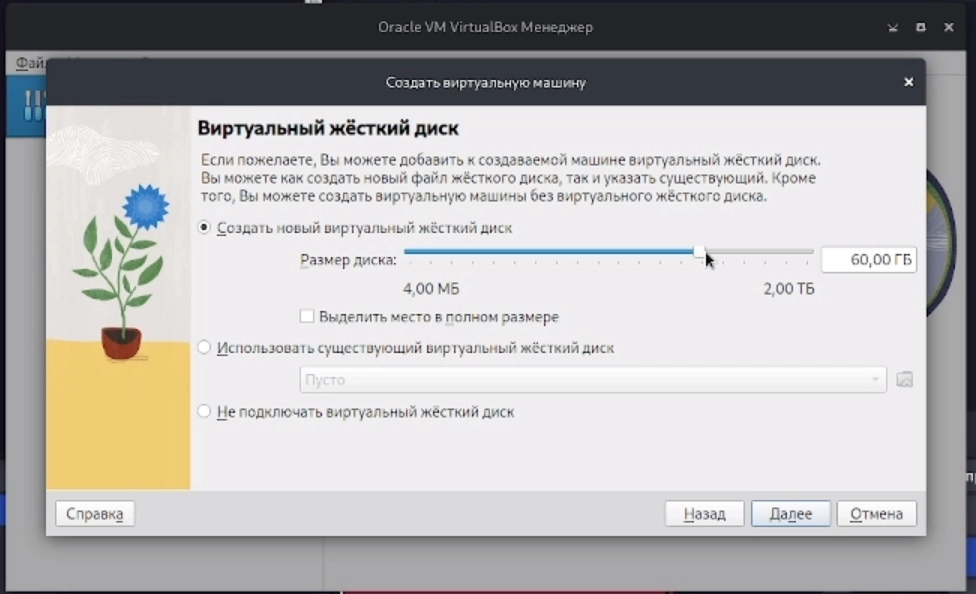
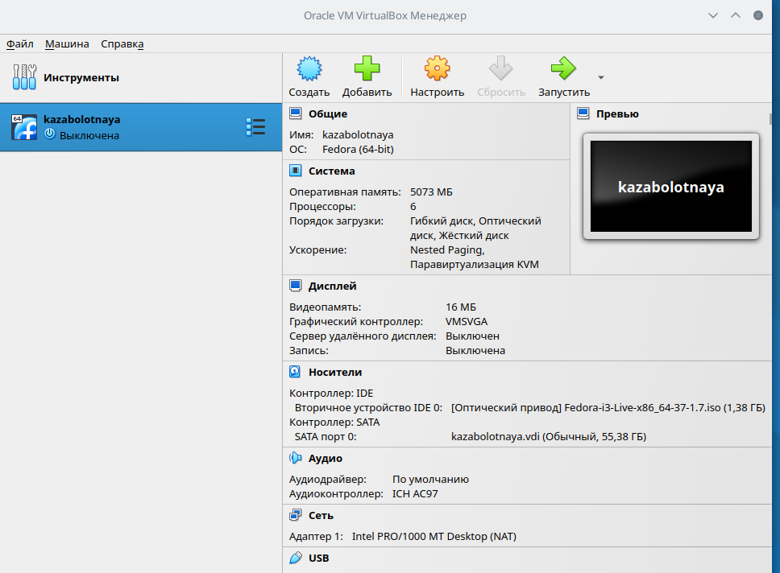
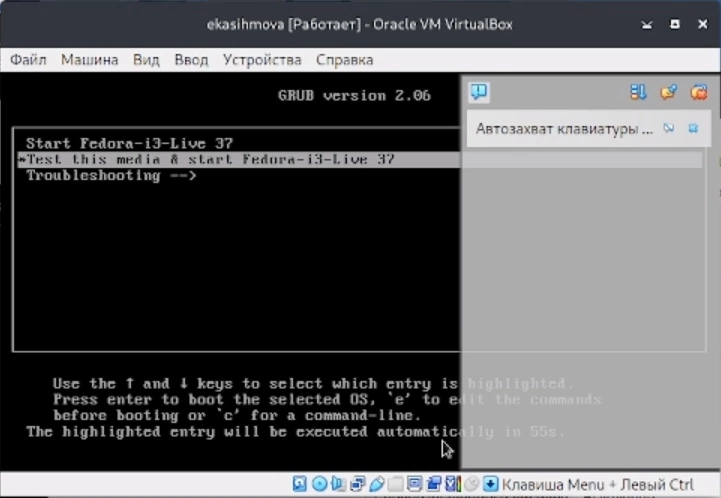
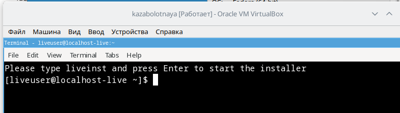
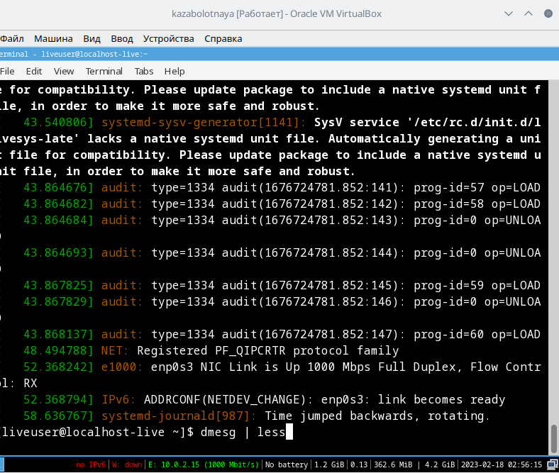
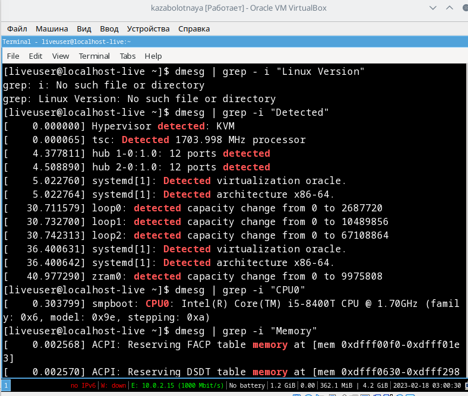
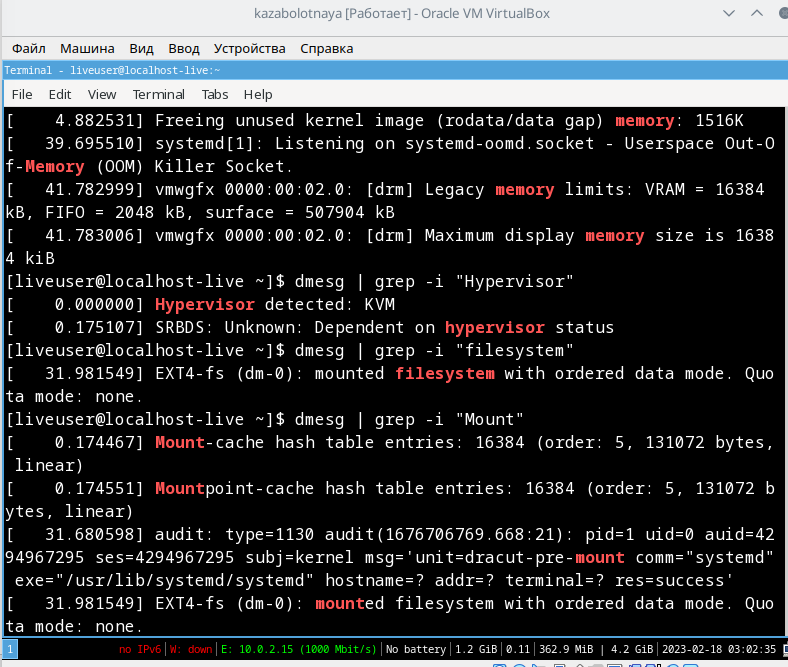

---
## Front matter
lang: ru-RU
title: Лабораторная работа №1
subtitle: 
author:
  - Заболотная Кристина
institute:
  - Российский университет дружбы народов, Москва, Россия

## i18n babel
babel-lang: russian
babel-otherlangs: english

## Formatting pdf
toc: false
toc-title: Содержание
slide_level: 2
aspectratio: 169
section-titles: true
theme: metropolis
header-includes:
 - \metroset{progressbar=frametitle,sectionpage=progressbar,numbering=fraction}
 - '\makeatletter'
 - '\beamer@ignorenonframefalse'
 - '\makeatother'
---

# Информация

## Докладчик

  * Заболотная Кристина Александровна
  * Студент группы НБИбд-01-22
  * Российский университет дружбы народов

## Актуальность

Работа с виртуальной машиной и терминалом.

## Цели и задачи

Целью данной работы является приобретение практических навыков установки операционной системы на виртуальную машину, настройки минимально необходимых для дальнейшей работы сервисов.

## Содержание исследования

1. Загружаем Fedora на компьютер. В связи с проблемами с OBS  Studio, а также с VirtualBox, перая часть выполнения лабораторной работы не записалась на видео.

{#fig:001 width=90%}

##

2. Настраиваем VirtualBox.

{#fig:002 width=90%}

##

3. Настраивем размер основной памяти и процессора.

{#fig:003 width=90%}

##

4. Устанавливаем размер виртуального жесткого диска.

{#fig:004 width=90%}

##

5. Настроили VirtualBox.

{#fig:005 width=90%}

##

6. Запускаем виртуальную машину.

{#fig:006 width=90%}

##

7. Открываем терминал в виртуальной машине.

{#fig:007 width=90%}

##

8. Дождемся загрузки графического окружения и откроем терминал. В окне терминала проанализируем последовательность загрузки системы, выполнив команду dmesg.

{#fig:008 width=90%}

##

9. Получим следующую информацию:
    1. Версия ядра Linux (Linux version).
    2. Частота процессора (Detected Mhz processor).
    3. Модель процессора (CPU0).
    4. Объём доступной оперативной памяти (Memory available).

{#fig:009 width=90%}

##

10. Получим следующую информацию:
    5. Тип обнаруженного гипервизора (Hypervisor detected).
    6. Тип файловой системы корневого раздела.
    7. Последовательность монтирования файловых систем.
    
{#fig:010 width=90%}

## Результаты

- преобретены практические навыки установки операционной системы на виртуальную машину.

## Итоговый слайд

В ходе выполнения лабораторной работы, были приобретены некоторые практические навыки установки операционной системы на виртуальную машину, настройки минимально необходимых для дальнейшей работы сервисов. Также я  научилась пользоваться консолью в целях получения информации об установленном ос. Вспомнила необходимые для работы с терминалом линукса команды.

