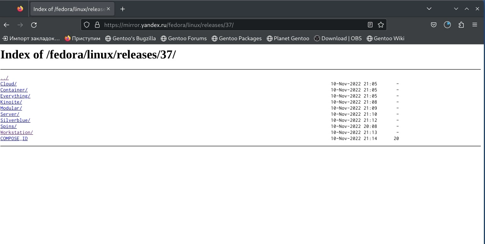
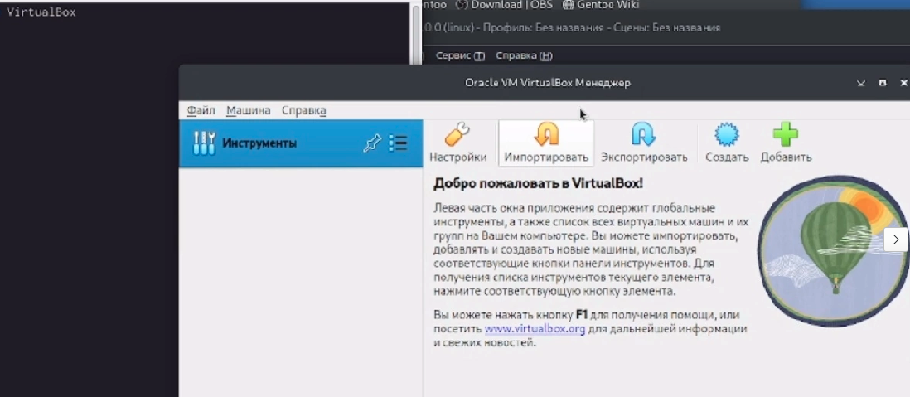
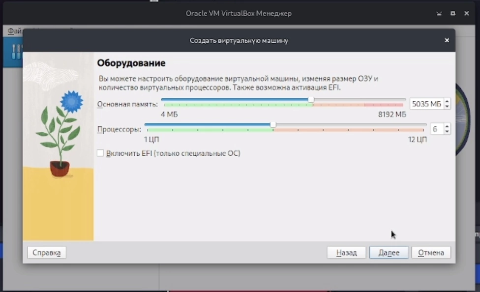
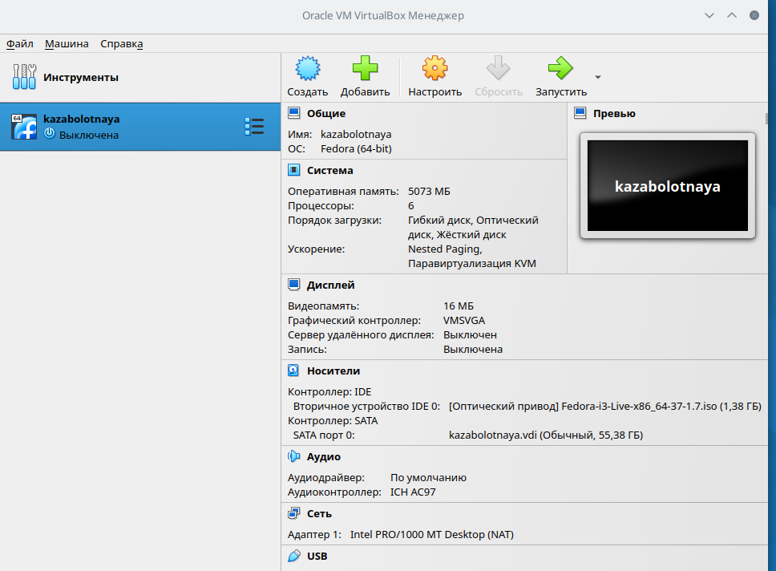
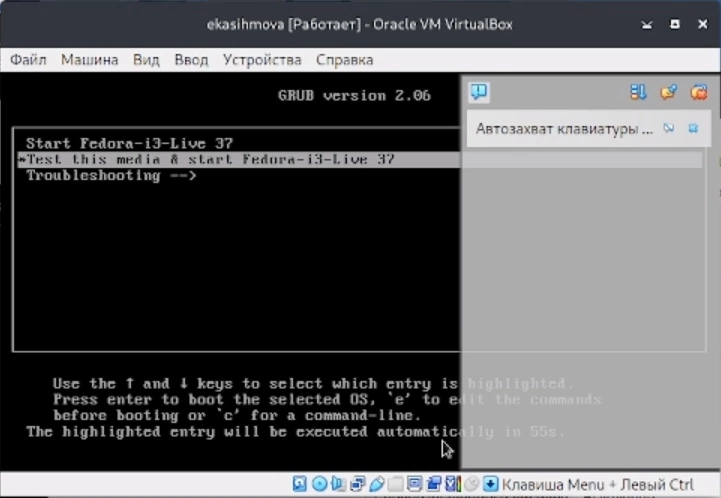
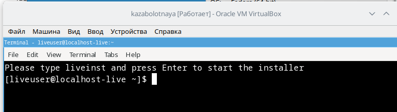
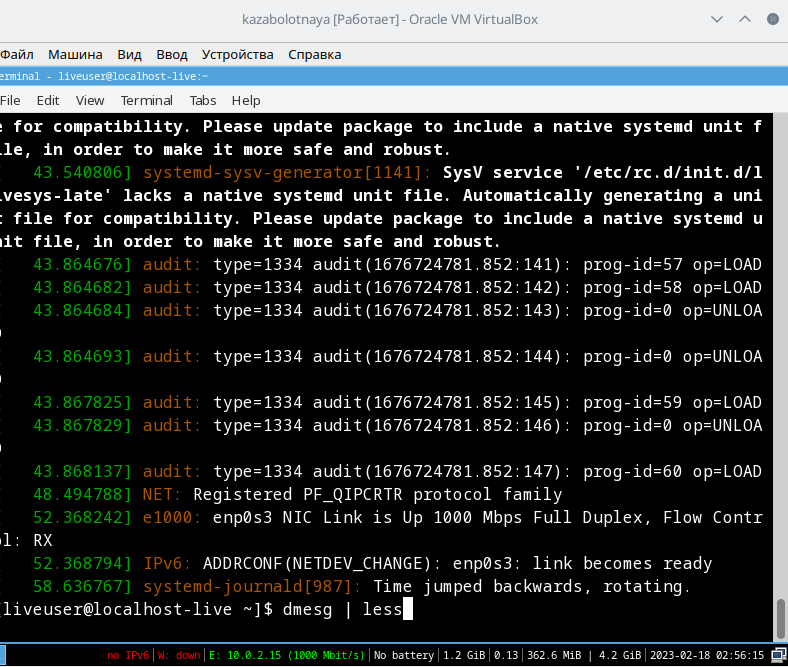
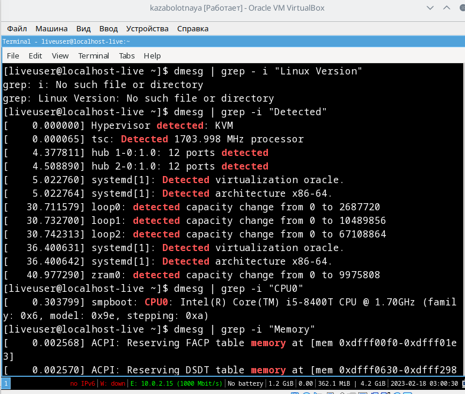
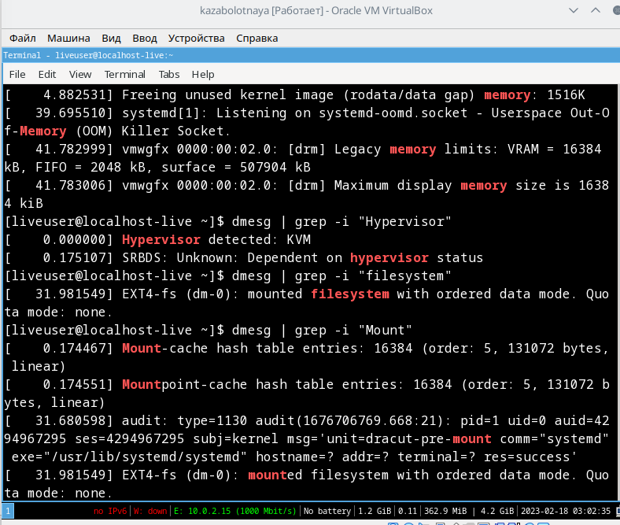

---
## Front matter
title: "Лабораторная работа №1"
subtitle: "Архитектура операционных систем"
author: "Заболотная Кристина"

## Generic otions
lang: ru-RU
toc-title: "Содержание"

## Bibliography
bibliography: bib/cite.bib
csl: pandoc/csl/gost-r-7-0-5-2008-numeric.csl

## Pdf output format
toc: true # Table of contents
toc-depth: 2
lof: true # List of figures
lot: true # List of tables
fontsize: 12pt
linestretch: 1.5
papersize: a4
documentclass: scrreprt
## I18n polyglossia
polyglossia-lang:
  name: russian
  options:
	- spelling=modern
	- babelshorthands=true
polyglossia-otherlangs:
  name: english
## I18n babel
babel-lang: russian
babel-otherlangs: english
## Fonts
mainfont: PT Serif
romanfont: PT Serif
sansfont: PT Sans
monofont: PT Mono
mainfontoptions: Ligatures=TeX
romanfontoptions: Ligatures=TeX
sansfontoptions: Ligatures=TeX,Scale=MatchLowercase
monofontoptions: Scale=MatchLowercase,Scale=0.9
## Biblatex
biblatex: true
biblio-style: "gost-numeric"
biblatexoptions:
  - parentracker=true
  - backend=biber
  - hyperref=auto
  - language=auto
  - autolang=other*
  - citestyle=gost-numeric
## Pandoc-crossref LaTeX customization
figureTitle: "Рис."
tableTitle: "Таблица"
listingTitle: "Листинг"
lofTitle: "Список иллюстраций"
lotTitle: "Список таблиц"
lolTitle: "Листинги"
## Misc options
indent: true
header-includes:
  - \usepackage{indentfirst}
  - \usepackage{float} # keep figures where there are in the text
  - \floatplacement{figure}{H} # keep figures where there are in the text
---

# Цель работы

Целью данной работы является приобретение практических навыков установки операционной системы на виртуальную машину, настройки минимально необходимых для дальнейшей работы сервисов.

# Теоретическое введение

Здесь описываются теоретические аспекты, связанные с выполнением работы.

Например, в табл. @tbl:std-dir приведено краткое описание стандартных каталогов Unix.

: Описание некоторых каталогов файловой системы GNU Linux {#tbl:std-dir}

| Имя каталога | Описание каталога                                                                                                          |
|--------------|----------------------------------------------------------------------------------------------------------------------------|
| `/`          | Корневая директория, содержащая всю файловую                                                                               |
| `/bin `      | Основные системные утилиты, необходимые как в однопользовательском режиме, так и при обычной работе всем пользователям     |
| `/etc`       | Общесистемные конфигурационные файлы и файлы конфигурации установленных программ                                           |
| `/home`      | Содержит домашние директории пользователей, которые, в свою очередь, содержат персональные настройки и данные пользователя |
| `/media`     | Точки монтирования для сменных носителей                                                                                   |
| `/root`      | Домашняя директория пользователя  `root`                                                                                   |
| `/tmp`       | Временные файлы                                                                                                            |
| `/usr`       | Вторичная иерархия для данных пользователя                                                                                 |

Более подробно об Unix см. в [@gnu-doc:bash;@newham:2005:bash;@zarrelli:2017:bash;@robbins:2013:bash;@tannenbaum:arch-pc:ru;@tannenbaum:modern-os:ru].

# Выполнение лабораторной работы

1. Загружаем Fedora на компьютер. В связи с проблемами с OBS  Studio, а также с VirtualBox, перая часть выполнения лабораторной работы не записалась на видео.

{#fig:001 width=90%}

2. Настраиваем VirtualBox.

{#fig:002 width=90%}

3. Настраивем размер основной памяти и процессора.

{#fig:003 width=90%}

4. Устанавливаем размер виртуального жесткого диска.

{#fig:004 width=90%}

5. Настроили VirtualBox.

{#fig:005 width=90%}

6. Запускаем виртуальную машину.

{#fig:006 width=90%}

7. Открываем терминал в виртуальной машине.

{#fig:007 width=90%}

8. Дождемся загрузки графического окружения и откроем терминал. В окне терминала проанализируем последовательность загрузки системы, выполнив команду dmesg.

{#fig:008 width=90%}

9. Получим следующую информацию:
    1. Версия ядра Linux (Linux version).
    2. Частота процессора (Detected Mhz processor).
    3. Модель процессора (CPU0).
    4. Объём доступной оперативной памяти (Memory available).

{#fig:009 width=90%}

10. Получим следующую информацию:
    5. Тип обнаруженного гипервизора (Hypervisor detected).
    6. Тип файловой системы корневого раздела.
    7. Последовательность монтирования файловых систем.
    
{#fig:010 width=90%}

# Контрольные вопросы.

1. Какую информацию содержит учётная запись пользователя? Имя и пароль
2. Укажите команды терминала и приведите примеры:
a. для получения справки по команде: info
б. для перемещения по файловой системе: mv
в. для просмотра содержимого каталога: ls
г. для определения объёма каталога: du
д. для создания / удаления каталогов / файлов: mkdir
е. для задания определённых прав на файл / каталог: chmod
ж. для просмотра истории команд: history

3. Что такое файловая система? Приведите примеры с краткой характеристикой.
Файловая система- это часть операционной системы, суть которой состоит в том, чтобы обеспечить пользователю удобный интерфейс при работе с данными, хранящимися на диске, и обеспечить совместное использование файлов несколькими пользователями и процессами. информация о разрешенном доступе, пароль для доступа к файлу, владелец файла, создатель файла, признак "только для чтения", признак "скрытый файл", признак "системный файл", признак "архивный файл", признак "двоичный/символьный", признак "временный" (удалить после завершения
процесса), признак блокировки, длина записи, указатель на ключевое поле в записи, длина ключа, времена создания, последнего доступа и последнего изменения, текущий размер файла, максимальный размер файла.

4. Как посмотреть, какие файловые системы подмонтированы в ОС? Команада - mount
   
5. Как удалить зависший процесс? Команда - kill

# Выводы

В ходе выполнения лабораторной работы, были приобретены некоторые практические навыки установки операционной системы на виртуальную машину, настройки минимально необходимых для дальнейшей работы сервисов. Также я  научилась пользоваться консолью в целях получения информации об установленном ос. Вспомнила необходимые для работы с терминалом линукса команды.

# Список литературы{.unnumbered}

::: {#refs}
:::
