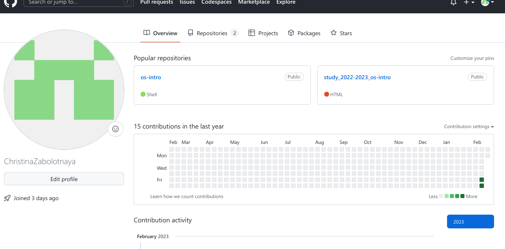
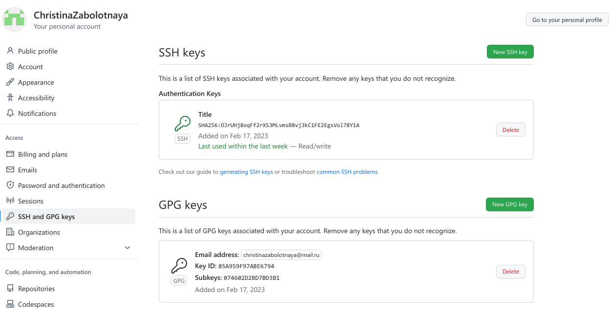
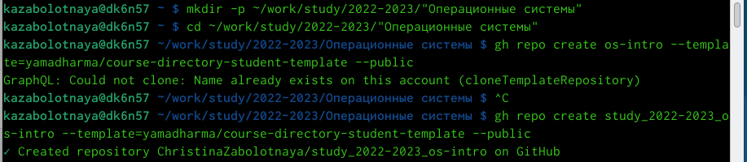
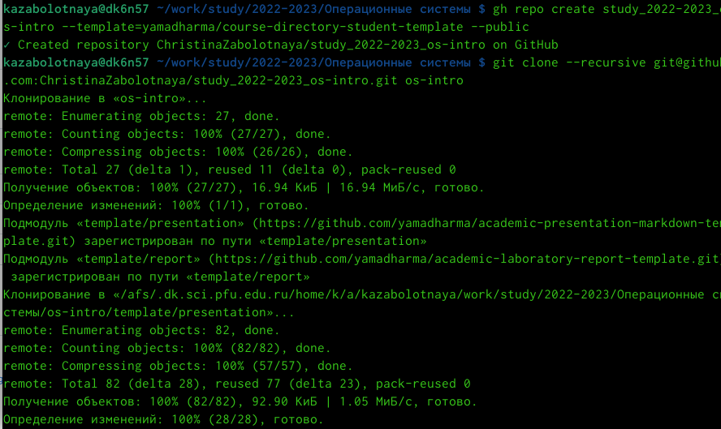
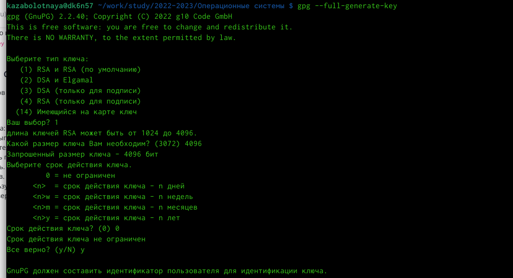
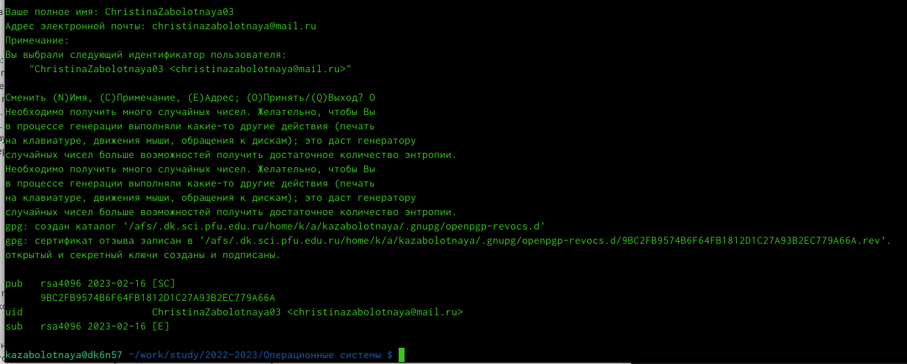
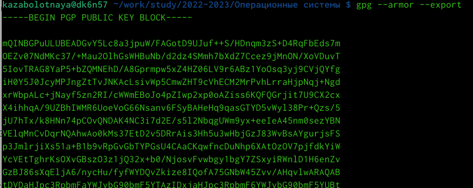
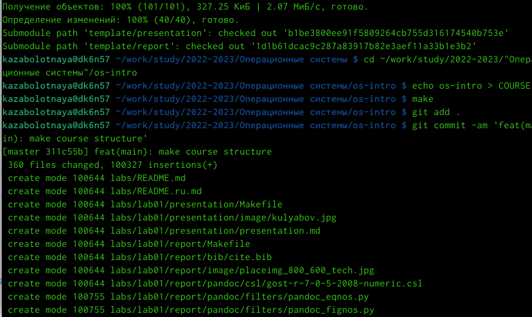
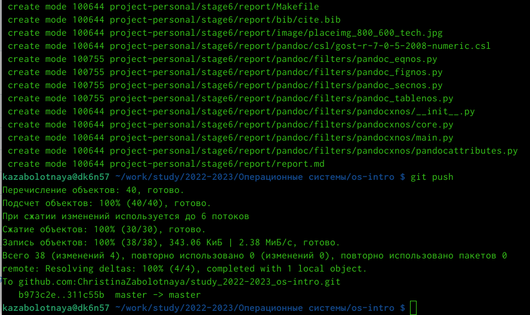

---
## Front matter
lang: ru-RU
title: Лабораторная работа №3
subtitle: 
author:
  - Заболотная Кристина
institute:
  - Российский университет дружбы народов, Москва, Россия

## i18n babel
babel-lang: russian
babel-otherlangs: english

## Formatting pdf
toc: false
toc-title: Содержание
slide_level: 2
aspectratio: 169
section-titles: true
theme: metropolis
header-includes:
 - \metroset{progressbar=frametitle,sectionpage=progressbar,numbering=fraction}
 - '\makeatletter'
 - '\beamer@ignorenonframefalse'
 - '\makeatother'
---

# Информация

## Докладчик

  * Заболотная Кристина Александровна
  * Студент группы НБИбд-01-22
  * Российский университет дружбы народов

  
## Актуальность

Лабораторная работа помогла нам научиться оформлять отчёты с помощью легковесного языка разметки Markdown.

## Цели и задачи

Целью данной лабораторной работы являлось: Научиться оформлять отчёты с помощью легковесного языка разметки Markdown.

## Содержание исследования

0. Аккаунт github и ключи ssh, gpg.

{#fig:008 width=90%}

## 

{#fig:009 width=90%}

##

1. Создадим шаблон рабочего пространства. 

{#fig:001 width=90%}

##

2. Ссылку - git@github.com:<owner> - берем с нашего gitgub.

{#fig:002 width=90%}

##

3. Создадим ключ pgp. Генерируем ключ. Выбираем опции: тип RSA and RSA; размер 4096; выберите срок действия; значение по умолчанию — 0 (срок действия не истекает никогда).

{#fig:003 width=90%}

##

4. GPG запросит личную информацию, которая сохранится в ключе: Имя (не менее 5 символов), Адрес электронной почты. Комментарий, оставляю это поле пустым.

{#fig:004 width=90%}

##

5. Экспортируем ключ в формате ASCII по его отпечатку.

{#fig:005 width=90%}

##

6. Перейдём в каталог курса, создадим необходимые каталоги, отправим файлы на сервер.

{#fig:006 width=90%}

##

7. Отправим файлы на сервер.

{#fig:007 width=90%}

## Результаты

Был оформлен отчёт лабораторной работы №2, где была изучена идеология и применение средств контроля версий, где были освоены основные умения по работе с git.

## Итоговый слайд

В ходе выполнения данной лабораторной работы мы научились оформлять отчёты с помощью легковесного языка разметки Markdown.

