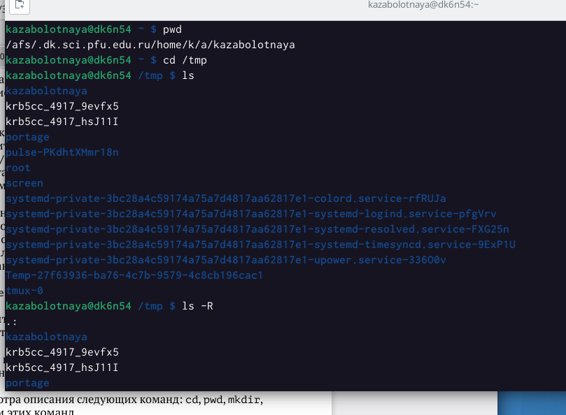
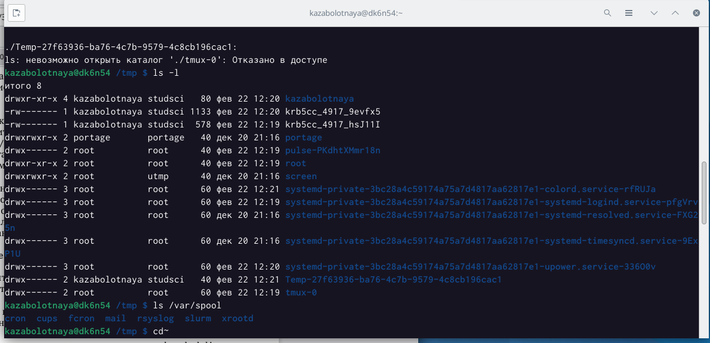
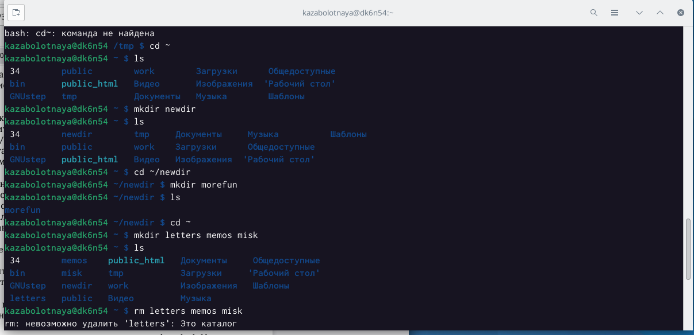
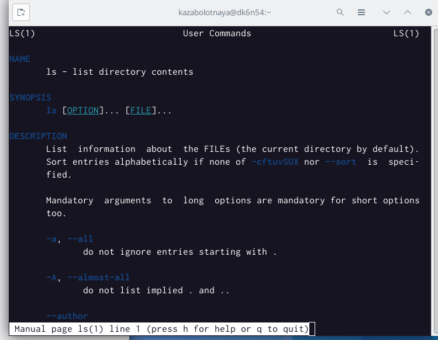
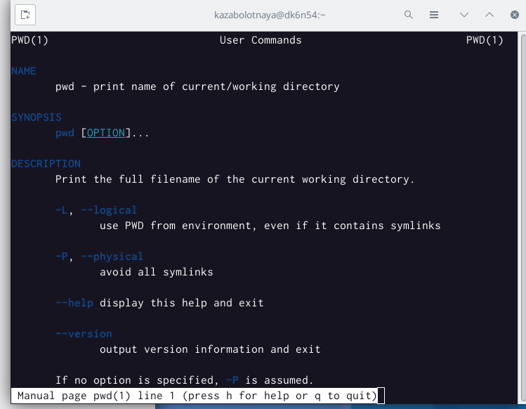
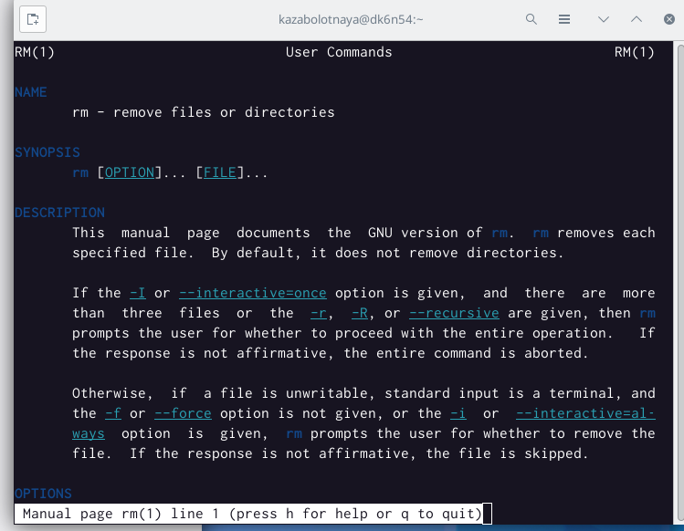
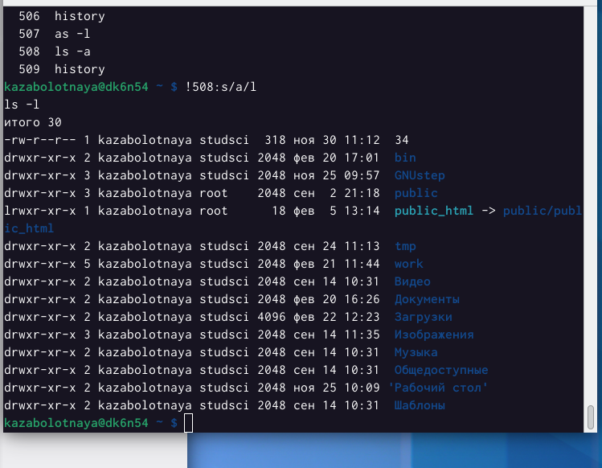

---
## Front matter
lang: ru-RU
title: Лабораторная работа №4
subtitle: "Основы интерфейса взаимодействия пользователя с системой Unix на уровне командной строки"
author:
  - Заболотная Кристина
institute:
  - Российский университет дружбы народов, Москва, Россия

## i18n babel
babel-lang: russian
babel-otherlangs: english

## Formatting pdf
toc: false
toc-title: Содержание
slide_level: 2
aspectratio: 169
section-titles: true
theme: metropolis
header-includes:
 - \metroset{progressbar=frametitle,sectionpage=progressbar,numbering=fraction}
 - '\makeatletter'
 - '\beamer@ignorenonframefalse'
 - '\makeatother'
---

# Информация

## Докладчик

  * Заболотная Кристина Александровна
  * Студент группы НБИбд-01-22
  * Российский университет дружбы народов

## Цели и задачи

Приобретение практических навыков взаимодействия пользователя с системой посредством командной строки.

## Содержание исследования

1. Находим полное имя нашего домашнего каталога, перейдём в каталог tmp, при помощи команды ls.

{#fig:001 width=90%}

##

2. Выполним команду var/spool. Есть подкаталог с именем cron.

{#fig:002 width=90%}

##

3. Перейдём в наш домашний каталог и выведим на экран его содержимое. Создадим новый каталог - newdir. В каталоге ~/newdir создадим новый каталог с именем morefun. В домашнем каталоге создадим одной командой три новых каталога с именами letters, memos, misk. 

{#fig:003 width=90%}

##

4. Удалим каталоги letters, memos, misk одной командой. Проверим, что они удалены.

{#fig:004 width=90%}

##

5. C помощью команды man определим опции команды ls. Разница в выводиой на экран информации: команда ls выводит на экран содержимое каталога. Команда ls -l выводит подробный список, в котором будет отображаться владелец, группа, дата создания, размер и другие параметры. Команда ls -F показывает тип объекта. C помощью команды man определим, какую опцию команды ls нужно использовать для просмотра содержимого не только указанного каталога, но и подкаталога, входящего в него. А именно: -R, -recutsive list subdirectories recursively. С помощью команды man определим набор опций команды ls, позволяющий отсортировать по времени последнего изменения выводимый список содержимого каталога с развёрнутым описанием файлов,а именно: -time-style=TIME STYLE -t -T -u.

{#fig:005 width=90%}

##

6. C помощью команды man man определим опции команды cd.

{#fig:006 width=90%}

##

7. C помощью команды man man определим опции команды pwd.

{#fig:007 width=90%}

##

8. C помощью команды man man определим опции команды mkdir.

{#fig:008 width=90%}

##

9. C помощью команды man man определим опции команды  rmdir.

{#fig:009 width=90%}

##

10. C помощью команды man man определим опции команды rm.

{#fig:010 width=90%}

##

11. Используя информацию, полученную при помощи команды history, выполним модификацию и исполнение нескольких команд из буфера команд.

{#fig:011 width=90%}

##

{#fig:012 width=90%}

## Итоговый слайд

В ходе выполнения данной лабораторной работы были приобретены практические навыки взаимодействия пользователя с системой Unix посредством командной строки.

