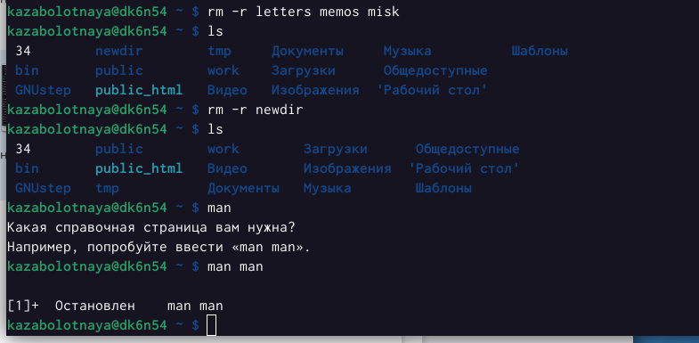
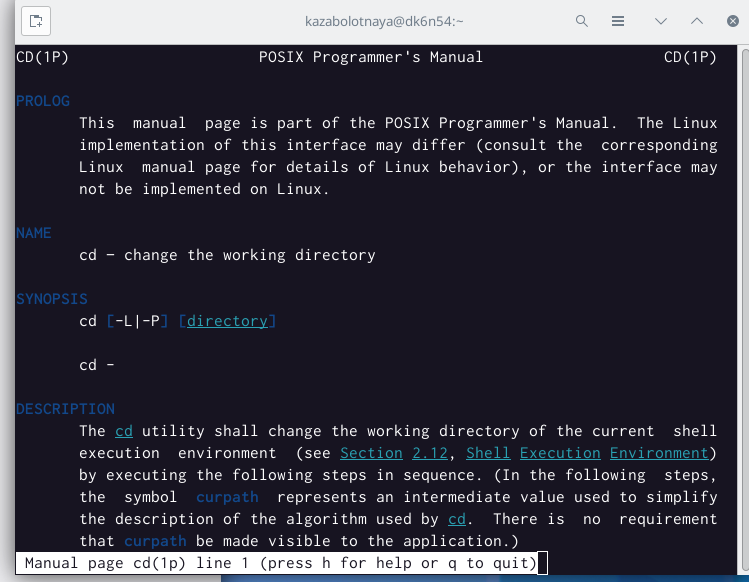
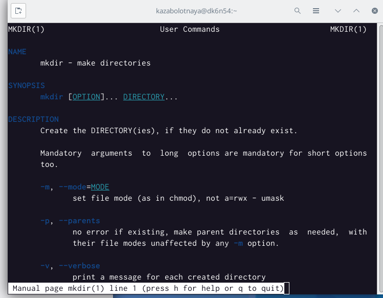
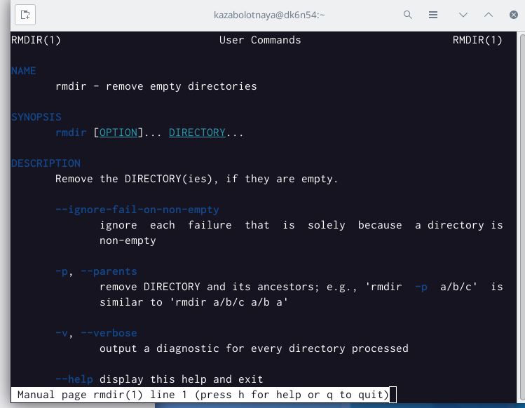
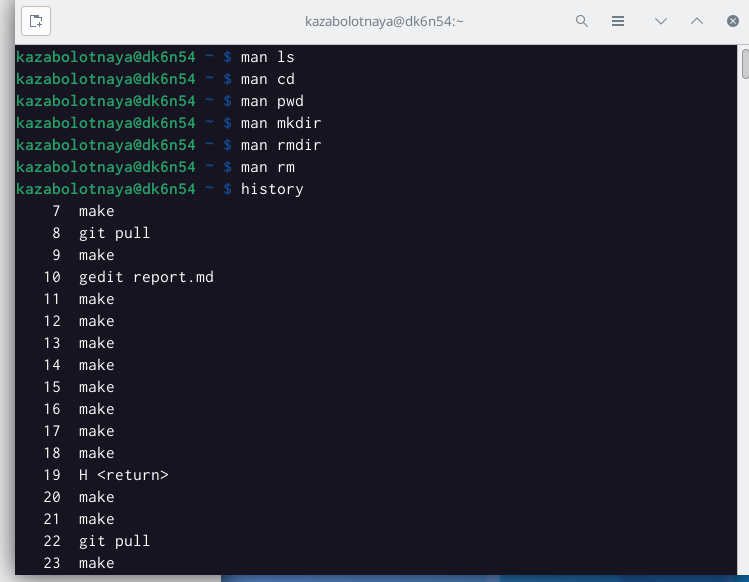

---
## Front matter
title: "Лабораторная работа №4"
subtitle: "Основы интерфейса взаимодействия пользователя с системой Unix на уровне командной строки"
author: "Заболотная Кристина Александровна"

## Generic otions
lang: ru-RU
toc-title: "Содержание"

## Bibliography
bibliography: bib/cite.bib
csl: pandoc/csl/gost-r-7-0-5-2008-numeric.csl

## Pdf output format
toc: true # Table of contents
toc-depth: 2
lof: true # List of figures
lot: true # List of tables
fontsize: 12pt
linestretch: 1.5
papersize: a4
documentclass: scrreprt
## I18n polyglossia
polyglossia-lang:
  name: russian
  options:
	- spelling=modern
	- babelshorthands=true
polyglossia-otherlangs:
  name: english
## I18n babel
babel-lang: russian
babel-otherlangs: english
## Fonts
mainfont: PT Serif
romanfont: PT Serif
sansfont: PT Sans
monofont: PT Mono
mainfontoptions: Ligatures=TeX
romanfontoptions: Ligatures=TeX
sansfontoptions: Ligatures=TeX,Scale=MatchLowercase
monofontoptions: Scale=MatchLowercase,Scale=0.9
## Biblatex
biblatex: true
biblio-style: "gost-numeric"
biblatexoptions:
  - parentracker=true
  - backend=biber
  - hyperref=auto
  - language=auto
  - autolang=other*
  - citestyle=gost-numeric
## Pandoc-crossref LaTeX customization
figureTitle: "Рис."
tableTitle: "Таблица"
listingTitle: "Листинг"
lofTitle: "Список иллюстраций"
lotTitle: "Список таблиц"
lolTitle: "Листинги"
## Misc options
indent: true
header-includes:
  - \usepackage{indentfirst}
  - \usepackage{float} # keep figures where there are in the text
  - \floatplacement{figure}{H} # keep figures where there are in the text
---

# Цель работы

Приобретение практических навыков взаимодействия пользователя с системой посредством командной строки.

# Выполнение лабораторной работы

1. Находим полное имя нашего домашнего каталога, перейдём в каталог tmp, при помощи команды ls.

{#fig:001 width=90%}

2. Выполним команду var/spool. Есть подкаталог с именем cron.

{#fig:002 width=90%}

3. Перейдём в наш домашний каталог и выведим на экран его содержимое. Создадим новый каталог - newdir. В каталоге ~/newdir создадим новый каталог с именем morefun. В домашнем каталоге создадим одной командой три новых каталога с именами letters, memos, misk. 

{#fig:003 width=90%}

4. Удалим каталоги letters, memos, misk одной командой. Проверим, что они удалены.

{#fig:004 width=90%}

5. C помощью команды man определим опции команды ls. Разница в выводиой на экран информации: команда ls выводит на экран содержимое каталога. Команда ls -l выводит подробный список, в котором будет отображаться владелец, группа, дата создания, размер и другие параметры. Команда ls -F показывает тип объекта. C помощью команды man определим, какую опцию команды ls нужно использовать для просмотра содержимого не только указанного каталога, но и подкаталога, входящего в него. А именно: -R, -recutsive list subdirectories recursively. С помощью команды man определим набор опций команды ls, позволяющий отсортировать по времени последнего изменения выводимый список содержимого каталога с развёрнутым описанием файлов,а именно: -time-style=TIME STYLE -t -T -u.

{#fig:005 width=90%}

6. C помощью команды man man определим опции команды cd.

{#fig:006 width=90%}

7. C помощью команды man man определим опции команды pwd.

{#fig:007 width=90%}

8. C помощью команды man man определим опции команды mkdir.

{#fig:008 width=90%}

9. C помощью команды man man определим опции команды  rmdir.

{#fig:009 width=90%}

10. C помощью команды man man определим опции команды rm.

{#fig:010 width=90%}

11. Используя информацию, полученную при помощи команды history, выполним модификацию и исполнение нескольких команд из буфера команд.

{#fig:011 width=90%}

{#fig:012 width=90%}

# Контрольные вопросы

1. Что такое командная строка - инструмент для передачи дейтвий которые должен выполнить компьютер.

2. pwd, realpath

3. ls -F

4. Можно отредактировать скрытый файл и заметить что он отображается, в данном случае стоит использовать ls, а точнее ls -a.
Пример: ls -a. Вывод: . ..
 
5. При помощи rm, rmdir можно удалить файл и каталог, можно это сделать одной и той же командой.
Пример: rm -r letters memos misk
Пример: rmdir -r letters memos misk
 
6. history

7. Пример: "!501:s/i/l". Выбираем строчку, пишем её номер в начале, далее команду которую хотим заменить на следующую.
 
8. Используем запятые для того чтобы записать сразу несколько команд.
 
9. Экранирование - способ заключения в кавычки одиночного символа. Экранируемый символ (\) сообщает интерпретатору, что следующий за этим символ воспринимается как обычный символ.
Пример: "echo "Мир: \"world\"." # echo "Мир: \"world\".
 
10. Охарактеризуйте вывод информации на экран после выполнения команды ls с опцией
 
11. Относительный путь к файлу - это путь к файлу относительно текущей папки. Например, при использовании pwd.
 
12. Получить информацию об интересующей вас команде можно с помощью команды man. Man ls выдаёт все варианты действий с комнадой.
 
13. Сочетание клавиш Ctr+C прерывает текущий процесс, запущенный в терминале.

# Выводы

В ходе выполнения данной лабораторной работы были приобретены практические навыки взаимодействия пользователя с системой Unix посредством командной строки.

# Список литературы{.unnumbered}

::: {#refs}
:::
