---
## Front matter
lang: ru-RU
title: Лабораторная работа №5
subtitle: Анализ файловой системы Linux. Команды для работы с файлами и каталогами
author:
  - Заболотная Кристина
institute:
  - Российский университет дружбы народов, Москва, Россия

## i18n babel
babel-lang: russian
babel-otherlangs: english

## Formatting pdf
toc: false
toc-title: Содержание
slide_level: 2
aspectratio: 169
section-titles: true
theme: metropolis
header-includes:
 - \metroset{progressbar=frametitle,sectionpage=progressbar,numbering=fraction}
 - '\makeatletter'
 - '\beamer@ignorenonframefalse'
 - '\makeatother'
---

# Информация

## Докладчик

  * Заболотная Кристина Александровна
  * Студент группы НБИбд-01-22
  * Российский университет дружбы народов

## Цели и задачи

Ознакомление с файловой системой Linux, её структурой, именами и содержанием каталогов. Приобретение практических навыков по применению команд для работы с файлами и каталогами, по управлению процессами (и работами), по проверке использования диска и обслуживанию файловой системы.

## Содержание исследования

1. Выполнены все примеры, приведенные в первой части лабораторной работы. Скопирован файл ~/abc1 в файл april и в файл may. Скопированы файлы april и may в каталог monthly. Скопирован файл moonthly/may в файл с именем june. Скопирован каталог monthly в каталог monthly.00. Скопирован moonthly.00 в каталог /tmp.

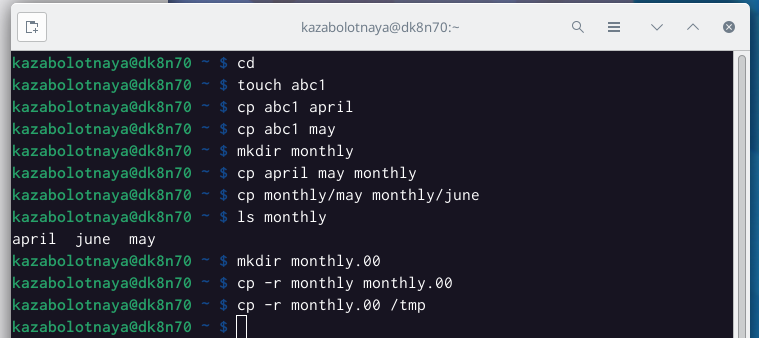{#fig:001 width=90%}

##

2. Изменение названия файла april на july в домашнем каталоге. Переместим файл july в каталог moonthly.00. Переименуем каталог moonthly.00 в moonthly.0.1. Переместим каталог monthly.01 в каталог reports. Переименуем каталог reports/monthly.01 в reports/moonthly. 

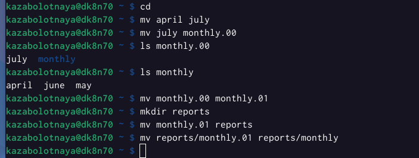{#fig:002 width=90%}

##

3. Создан файл ~/may с правом выполнения для владельца. Лишён владелец файла ~/may права на выполнение. Создан каталог moonthly с запретом на чтение для членов группы и всех остальных пользователей. Создан файл ~/abc1 с правом записи для членов группы.

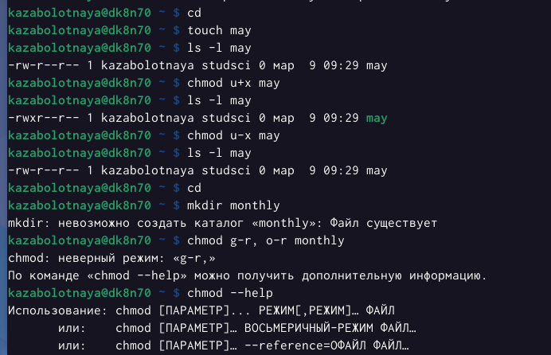{#fig:003 width=90%}

##

4. Команды touch abc1, chmod g+w abc1

{#fig:004 width=90%}

##

5. Команда df, которая выведет на экран список всех файловых систем в соответствии с именами устройств, с указанием размера и точки монтирования, для определения объёма свободного пространства на файловой системе.

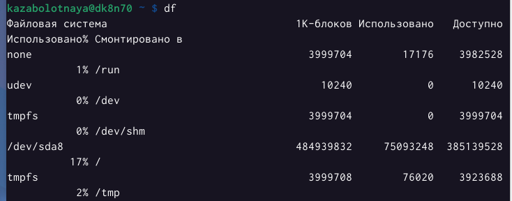{#fig:005 width=90%}

##

6. Выполнены следующие действия, зафиксировав в отчёте по лабораторной работе используемые при этом команды и результаты их выполнения:
2.1. Скопирован файл /usr/include/sys/io.h в домашний каталог и назван equipment.
2.2. В домашнем каталоге создана директория ~/ski.plases.
2.3. Переместила файл equipment в каталог ~/ski.plases.
2.4. Переименовала файл ~/ski.plases/equipment в ~/ski.plases/equiplist.
2.5. Создала в домашнем каталоге файл abc1 и скопировала его в каталог ~/ski.plases, назвала его equiplist2.
2.6. Создала каталог с именем equipment в каталоге ~/ski.plases.
2.7. Переместила файлы ~/ski.plases/equiplist и equiplist2 в каталог ~/ski.plases/equipment.
2.8. Создала и переместила каталог ~/newdir в каталог ~/ski.plases и назовала его plans.

{#fig:006 width=90%}

##

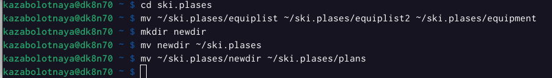{#fig:007 width=90%}

##

{#fig:008 width=90%}

##

7. Определила опции команды chmod, необходимые для того, чтобы присвоить перечисленным ниже файлам выделенные права доступа, считая, что в начале таких прав нет. (3.1. drwxr--r-- ... australia
3.2. drwx--x--x ... play; 3.3. -r-xr--r-- ... my_os; 3.4. -rw-rw-r-- ... feathers)

{#fig:009 width=90%}

##

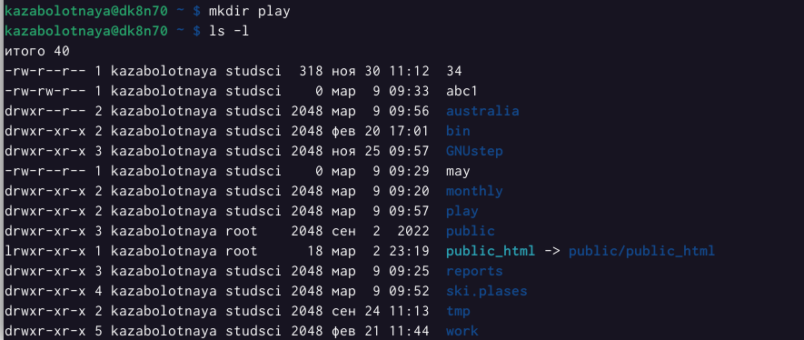{#fig:010 width=90%}

##

{#fig:011 width=90%}

##

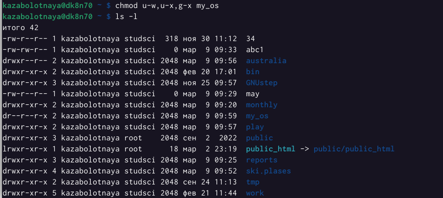{#fig:012 width=90%}

##

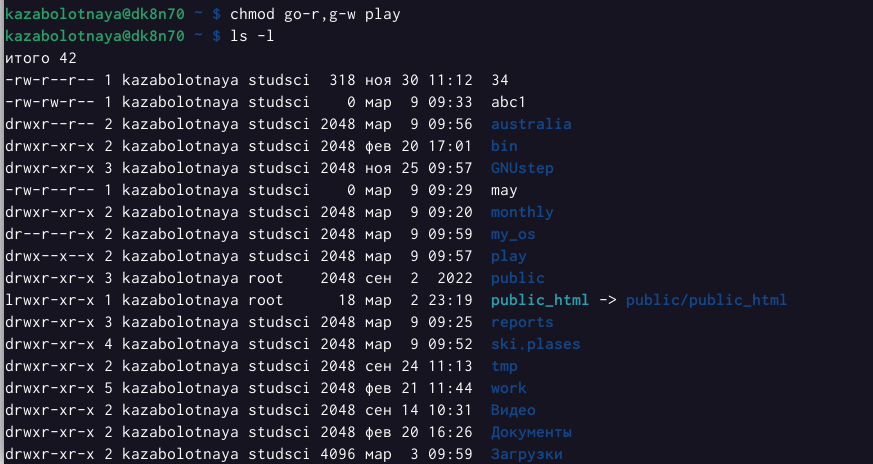{#fig:013 width=90%}

##

{#fig:014 width=90%}

##

8. 4. Проделала приведённые ниже упражнения, записывая в отчёт по лабораторной работе используемые при этом команды:
4.1. Не просмотрела содержимое файла /etc/password, его нет.
4.2. Скопировала файл ~/feathers в файл ~/file.old.
4.3. Переместила файл ~/file.old в каталог ~/play.
4.4. Скопировала каталог ~/play в каталог ~/fun.
4.5. Переместила каталог ~/fun в каталог ~/play и назовите его games.
4.6. Лишила владельца файла ~/feathers права на чтение.
4.7. Что произойдёт, если вы попытаетесь просмотреть файл ~/feathers командой cat - отказано в доступе.
4.8. Что произойдёт, если вы попытаетесь скопировать файл ~/feathers, cp.
4.9. Дан владельцу файла ~/feathers право на чтение командой chmod u+r.
4.10. Лишила владельца каталога ~/play права на выполнение командой chmod u-x.
4.11. Перешла в каталог ~/play. 
4.12. Дан владельцу каталога ~/play право на выполнение командой chmod u+x.

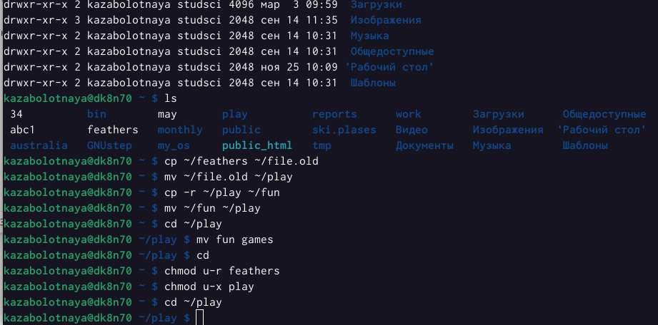{#fig:015 width=90%}

##

9. Команда man.

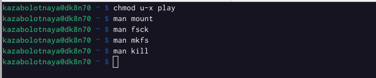{#fig:020 width=90%}

##

10. Прочитала man по командам mount, fsck, mkfs, kill.

{#fig:016 width=90%}

##

{#fig:017 width=90%}

##

{#fig:018 width=90%}

##

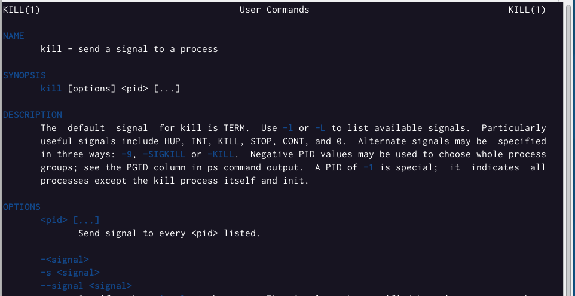{#fig:019 width=90%}

Характеристика: mount применяется для монтирования файловых системы; fsck восстанавливает поврежденную файловую систему или проверяет на целостность; mkfs создает новую файловую систему; kill используется для принудительного завершения работы приложений.

## Итоговый слайд

В ходе выполнения данной лабораторной работы я ознакомленилась с файловой системой Linux, её  структурой, именами и содержанием каталогов. Были приобретены практические навыки по применению команд для работы с файлами и каталогами, по управлению процессами (и работами), по проверке использования диска и обслуживанию файловой системы.

