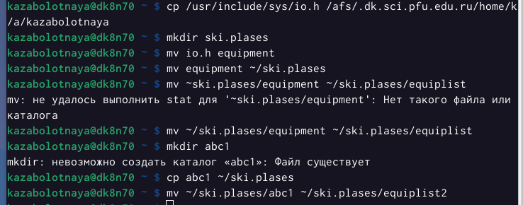
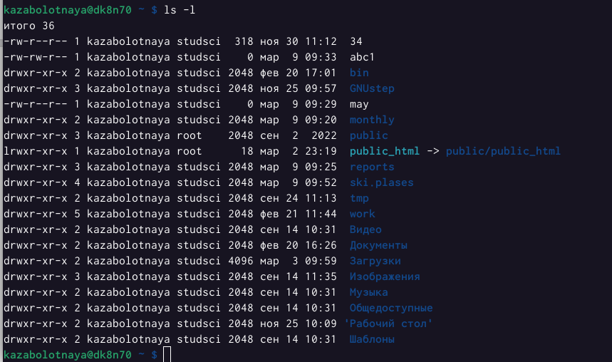
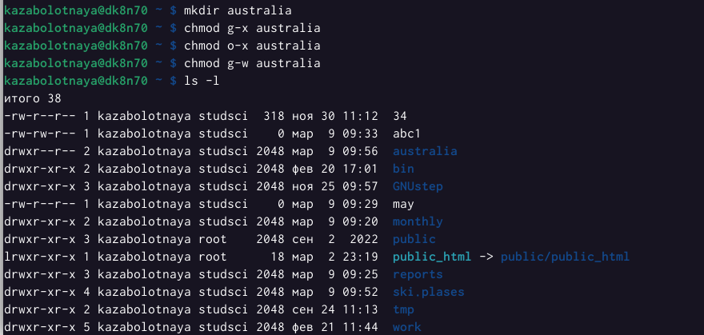
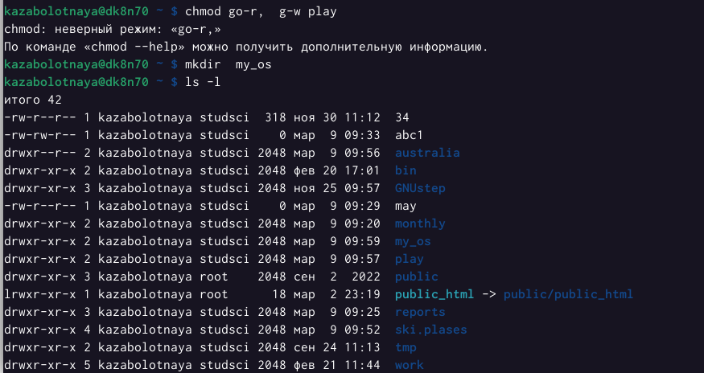
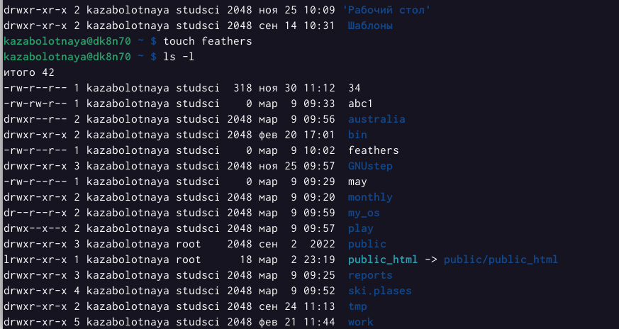
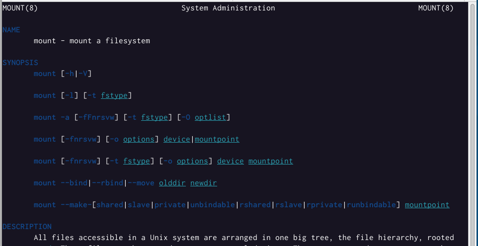
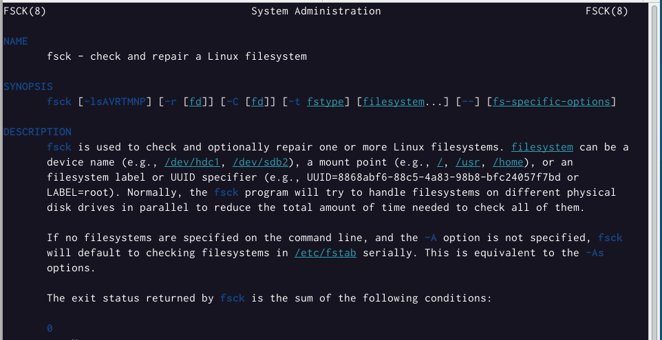
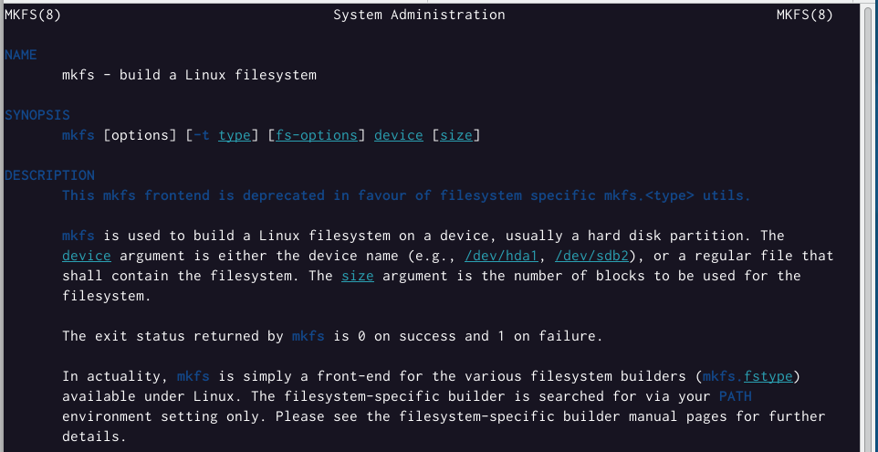

---
## Front matter
title: "Лабораторная работа №5"
subtitle: "Анализ файловой системы Linux. Команды для работы с файлами и каталогами."
author: "Заболотная Кристина Александровна"

## Generic otions
lang: ru-RU
toc-title: "Содержание"

## Bibliography
bibliography: bib/cite.bib
csl: pandoc/csl/gost-r-7-0-5-2008-numeric.csl

## Pdf output format
toc: true # Table of contents
toc-depth: 2
lof: true # List of figures
lot: true # List of tables
fontsize: 12pt
linestretch: 1.5
papersize: a4
documentclass: scrreprt
## I18n polyglossia
polyglossia-lang:
  name: russian
  options:
	- spelling=modern
	- babelshorthands=true
polyglossia-otherlangs:
  name: english
## I18n babel
babel-lang: russian
babel-otherlangs: english
## Fonts
mainfont: PT Serif
romanfont: PT Serif
sansfont: PT Sans
monofont: PT Mono
mainfontoptions: Ligatures=TeX
romanfontoptions: Ligatures=TeX
sansfontoptions: Ligatures=TeX,Scale=MatchLowercase
monofontoptions: Scale=MatchLowercase,Scale=0.9
## Biblatex
biblatex: true
biblio-style: "gost-numeric"
biblatexoptions:
  - parentracker=true
  - backend=biber
  - hyperref=auto
  - language=auto
  - autolang=other*
  - citestyle=gost-numeric
## Pandoc-crossref LaTeX customization
figureTitle: "Рис."
tableTitle: "Таблица"
listingTitle: "Листинг"
lofTitle: "Список иллюстраций"
lotTitle: "Список таблиц"
lolTitle: "Листинги"
## Misc options
indent: true
header-includes:
  - \usepackage{indentfirst}
  - \usepackage{float} # keep figures where there are in the text
  - \floatplacement{figure}{H} # keep figures where there are in the text
---

# Цель работы

Ознакомление с файловой системой Linux, её структурой, именами и содержанием каталогов. Приобретение практических навыков по применению команд для работы с файлами и каталогами, по управлению процессами (и работами), по проверке использования диска и обслуживанию файловой системы.

# Задание

1. Выполните все примеры, приведённые в первой части описания лабораторной работы.
2. Выполните следующие действия, зафиксировав в отчёте по лабораторной работе используемые при этом команды и результаты их выполнения: 
Скопируйте файл /usr/include/sys/io.h в домашний каталог и назовите его equipment. Если файла io.h нет, то используйте любой другой файл в каталоге /usr/include/sys/ вместо него.
В домашнем каталоге создайте директорию ~/ski.plases.
Переместите файл equipment в каталог ~/ski.plases.
Переименуйте файл ~/ski.plases/equipment в ~/ski.plases/equiplist.
Создайте в домашнем каталоге файл abc1 и скопируйте его в каталог ~/ski.plases, назовите его equiplist2.
Создайте каталог с именем equipment в каталоге ~/ski.plases.
Переместите файлы ~/ski.plases/equiplist и equiplist2 в каталог ~/ski.plases/equipment.
Создайте и переместите каталог ~/newdir в каталог ~/ski.plases и назовите его plans.
3. Определите опции команды chmod, необходимые для того, чтобы присвоить перечисленным ниже файлам выделенные права доступа, считая, что в начале таких прав нет:
3.1. drwxr--r-- ... australia
3.2. drwx--x--x ... play
3.3. -r-xr--r-- ... my_os
3.4. -rw-rw-r-- ... feathers
При необходимости создайте нужные файлы.
4. Проделайте приведённые ниже упражнения, записывая в отчёт по лабораторной работе используемые при этом команды:
4.1. Просмотрите содержимое файла /etc/password.
4.2. Скопируйте файл ~/feathers в файл ~/file.old.
4.3. Переместите файл ~/file.old в каталог ~/play.
4.4. Скопируйте каталог ~/play в каталог ~/fun.
4.5. Переместите каталог ~/fun в каталог ~/play и назовите его games.
4.6. Лишите владельца файла ~/feathers права на чтение.
4.7. Что произойдёт, если вы попытаетесь просмотреть файл ~/feathers командой cat?
4.8. Что произойдёт, если вы попытаетесь скопировать файл ~/feathers?
4.9. Дайте владельцу файла ~/feathers право на чтение.
4.10. Лишите владельца каталога ~/play права на выполнение.
4.11. Перейдите в каталог ~/play. Что произошло?
4.12. Дайте владельцу каталога ~/play право на выполнение.
5. Прочитайте man по командам mount, fsck, mkfs, kill и кратко их охарактеризуйте, приведя примеры.

# Выполнение лабораторной работы

1. Выполнены все примеры, приведенные в первой части лабораторной работы. Скопирован файл ~/abc1 в файл april и в файл may. Скопированы файлы april и may в каталог monthly. Скопирован файл moonthly/may в файл с именем june. Скопирован каталог monthly в каталог monthly.00. Скопирован moonthly.00 в каталог /tmp.

{#fig:001 width=90%}

2. Изменение названия файла april на july в домашнем каталоге. Переместим файл july в каталог moonthly.00. Переименуем каталог moonthly.00 в moonthly.0.1. Переместим каталог monthly.01 в каталог reports. Переименуем каталог reports/monthly.01 в reports/moonthly. 

{#fig:002 width=90%}

3. Создан файл ~/may с правом выполнения для владельца. Лишён владелец файла ~/may права на выполнение. Создан каталог moonthly с запретом на чтение для членов группы и всех остальных пользователей. Создан файл ~/abc1 с правом записи для членов группы.

{#fig:003 width=90%}

4. Команды touch abc1, chmod g+w abc1

{#fig:004 width=90%}

5. Команда df, которая выведет на экран список всех файловых систем в соответствии с именами устройств, с указанием размера и точки монтирования, для определения объёма свободного пространства на файловой системе.

{#fig:005 width=90%}

6. Выполнены следующие действия, зафиксировав в отчёте по лабораторной работе используемые при этом команды и результаты их выполнения:
2.1. Скопирован файл /usr/include/sys/io.h в домашний каталог и назван equipment.
2.2. В домашнем каталоге создана директория ~/ski.plases.
2.3. Переместила файл equipment в каталог ~/ski.plases.
2.4. Переименовала файл ~/ski.plases/equipment в ~/ski.plases/equiplist.
2.5. Создала в домашнем каталоге файл abc1 и скопировала его в каталог ~/ski.plases, назвала его equiplist2.
2.6. Создала каталог с именем equipment в каталоге ~/ski.plases.
2.7. Переместила файлы ~/ski.plases/equiplist и equiplist2 в каталог ~/ski.plases/equipment.
2.8. Создала и переместила каталог ~/newdir в каталог ~/ski.plases и назовала его plans.

{#fig:006 width=90%}

{#fig:007 width=90%}

{#fig:008 width=90%}

7. Определила опции команды chmod, необходимые для того, чтобы присвоить перечисленным ниже файлам выделенные права доступа, считая, что в начале таких прав нет. (3.1. drwxr--r-- ... australia
3.2. drwx--x--x ... play; 3.3. -r-xr--r-- ... my_os; 3.4. -rw-rw-r-- ... feathers)

{#fig:009 width=90%}

{#fig:010 width=90%}

{#fig:011 width=90%}

{#fig:012 width=90%}

{#fig:013 width=90%}

{#fig:014 width=90%}

8. 4. Проделала приведённые ниже упражнения, записывая в отчёт по лабораторной работе используемые при этом команды:
4.1. Не просмотрела содержимое файла /etc/password, его нет.
4.2. Скопировала файл ~/feathers в файл ~/file.old.
4.3. Переместила файл ~/file.old в каталог ~/play.
4.4. Скопировала каталог ~/play в каталог ~/fun.
4.5. Переместила каталог ~/fun в каталог ~/play и назовите его games.
4.6. Лишила владельца файла ~/feathers права на чтение.
4.7. Что произойдёт, если вы попытаетесь просмотреть файл ~/feathers командой cat - отказано в доступе.
4.8. Что произойдёт, если вы попытаетесь скопировать файл ~/feathers, cp.
4.9. Дан владельцу файла ~/feathers право на чтение командой chmod u+r.
4.10. Лишила владельца каталога ~/play права на выполнение командой chmod u-x.
4.11. Перешла в каталог ~/play. 
4.12. Дан владельцу каталога ~/play право на выполнение командой chmod u+x.

{#fig:015 width=90%}

9. Команда man.

{#fig:020 width=90%}

10. Прочитала man по командам mount, fsck, mkfs, kill.

{#fig:016 width=90%}

{#fig:017 width=90%}

{#fig:018 width=90%}

{#fig:019 width=90%}

Характеристика: mount применяется для монтирования файловых системы; fsck восстанавливает поврежденную файловую систему или проверяет на целостность; mkfs создает новую файловую систему; kill используется для принудительного завершения работы приложений.

# Контрольные вопросы

1. Характеристика файловой системы, которая использовалась в данной лабораторной работе: Файлы: abc1, april, may, june, july, isdv4.h, equipment, equiplist, equiplist2, my_os, feathers, file.old. Каталоги: monthly, monthly.00, tmp, monthly.01, reports, usr, ski.plases, equipment, newdir, plans, australia, play, etc, fun, games. 
2. Пример общей структуры файловой системы: /home/pdarzhankina/monthly/april, где /home/pdarzhankina – домашний каталог, /monthly – каталог, находящийся в домашнем и содержащий файл, /аpril – файл, находящийся в каталоге. 
3. Чтобы содержимое некоторой файловой системы было доступно операционной системе должно быть выполнено монтирование тома. 
4. Основные причины нарушения целостности файловой системы:
• Один блок адресуется несколькими mode (принадлежит нескольким файлам).
• Блок помечен как свободный, но в то же время занят (на него ссылается onode).
• Блок помечен как занятый, но в то же время свободен (ни один inode на него не ссылается).
• Неправильное число ссылок в inode (недостаток или избыток ссылающихся записей в каталогах).
• Несовпадение между размером файла и суммарным размером адресуемых inode блоков. Недопустимые адресуемые блоки (например, расположенные за пределами файловой системы).
• “Потерянные” файлы (правильные inode, на которые не ссылаются записи каталогов).
• Недопустимые или неразмещенные номера inode в записях каталогов. Чтобы устранить повреждения файловой системы используется команда fsck.
5. Команда mkfs создаёт новую файловую систему.
6. Характеристика команд, которые позволяют просмотреть текстовые файлы:
• для просмотра небольших файлов удобно пользоваться командой cat.
• для просмотра больших файлов используйте команду less — она позволяет осуществлять постраничный просмотр файлов.
• для просмотра начала файла можно воспользоваться командой head, по умолчанию она выводит первые 10 строк файла.
• команда tail выводит несколько (по умолчанию 10) последних строк файла.
7. Основные возможности команды cp:
• копирование файла в текущем каталоге.
• копирование нескольких файлов в каталог.
• копирование файлов в произвольном каталоге. Опция i в команде cp выведет на экран запрос подтверждения о перезаписи файла, если на место целевого файла вы поставите имя уже существующего файла. Команда cp с опцией r (recursive) позволяет копировать каталоги вместе с входящими в
них файлами и каталогами.
8. Характеристика команд перемещения и переименования файлов и каталогов:
• переименование файлов в текущем каталоге. mv 
• перемещение файлов в другой каталог. mv 
Если необходим запрос подтверждения о перезаписи файла, то нужно использовать опцию i.
• переименование каталогов в текущем каталоге. mv
• перемещение каталога в другой каталог. mv
• переименование каталога, не являющегося текущим.mv < каталог/новое_название_каталога>
9. Каждый файл или каталог имеет права доступа: чтение (разрешены просмотр и копирование файла, разрешён просмотр списка входящих в каталог файлов), запись (разрешены изменение и переименование файла, разрешены создание и удаление файлов каталога), выполнение (разрешено выполнение файла, разрешён доступ в каталог и есть возможность сделать его текущим). Они могу быть изменены командой chmod.

# Выводы

В ходе выполнения данной лабораторной работы я ознакомленилась с файловой системой Linux, её  структурой, именами и содержанием каталогов. Были приобретены практические навыки по применению команд для работы с файлами и каталогами, по управлению процессами (и работами), по проверке использования диска и обслуживанию файловой системы.

# Список литературы{.unnumbered}

::: {#refs}
:::
