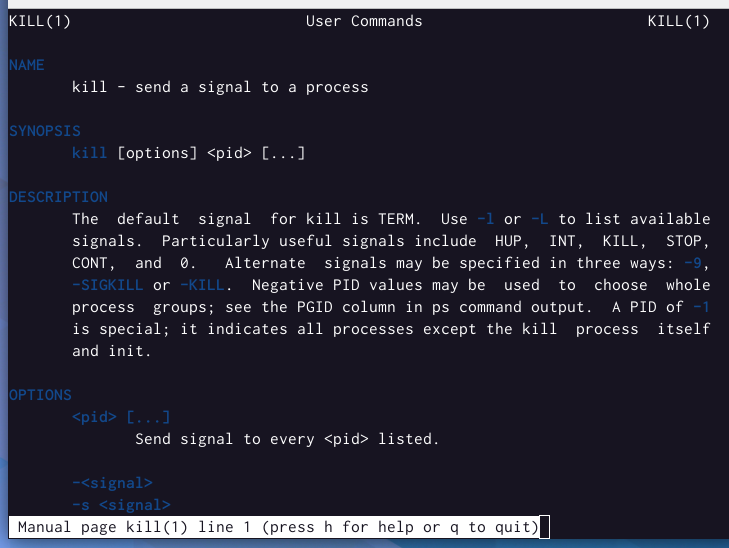
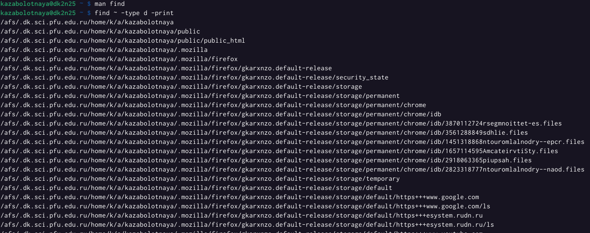

---
## Front matter
lang: ru-RU
title: Лабораторная работа №6
subtitle: Поиск файлов. Перенаправление ввода-вывода. Просмотр запущенных процессов.
author:
  - Заболотная Кристина
institute:
  - Российский университет дружбы народов, Москва, Россия

## i18n babel
babel-lang: russian
babel-otherlangs: english

## Formatting pdf
toc: false
toc-title: Содержание
slide_level: 2
aspectratio: 169
section-titles: true
theme: metropolis
header-includes:
 - \metroset{progressbar=frametitle,sectionpage=progressbar,numbering=fraction}
 - '\makeatletter'
 - '\beamer@ignorenonframefalse'
 - '\makeatother'
---

# Информация

## Докладчик

  * Заболотная Кристина Александровна
  * Студент группы НБИбд-01-22
  * Российский университет дружбы народов

## Цели и задачи

Ознакомление с инструментами поиска файлов и фильтрации текстовых данных. Приобретение практических навыков: по управлению процессами (и заданиями), по проверке использования диска и обслуживанию файловых систем.

## Содержание исследования

1. Зашла в систему, используя своё имя пользователя. Записала в файл file.txt названия файлов, содержащихся в каталоге /etc. Дописала в этот же файл названия файлов, содержащихся в моём домашнем каталоге.

{#fig:001 width=90%}

##

2. Вывела имена всех файлов из file.txt, имеющих расширение .conf, после чего записала их в новый текстовой файл conf.txt.

{#fig:002 width=90%}

##

3. Определила, какие файлы в моём домашнем каталоге имеют имена, начинающиеся с символа c.

{#fig:003 width=90%}

##

4. Вывела на экран (по странично) имена файлов из каталога /etc, начинающиеся с символа h.

{#fig:005 width=90%}

##

{#fig:004 width=90%}

##

5. Запустила в фоновом режиме процесс, который будет записывать в файл ~/logfile файлы, имена которых начинаются с log. Удалила файл ~/logfile. 

{#fig:006 width=90%}

##

6. Запустила из консоли в фоновом режиме редактор gedit. Определила идентификатор процесса gedit, используя команду ps, конвейер и фильтр grep.

{#fig:007 width=90%}

##

7. Прочла справку (man) команды kill, после чего использовала её для завершения процесса gedit. 

{#fig:008 width=90%}

##

{#fig:009 width=90%}

##

8. Выполнила команды df и du, предварительно получив более подробную информацию об этих командах, с помощью команды man.

{#fig:010 width=90%}

##

{#fig:011 width=90%}

##

{#fig:012 width=90%}

##

{#fig:013 width=90%}

##

{#fig:014 width=90%}

##

9. Воспользовавшись справкой команды find, вывела имена всех директорий, имеющихся в домашнем каталоге.

{#fig:015 width=90%}

##

{#fig:016 width=90%}

## Итоговый слайд

В ходе выполнения данной лабораторной работы я ознакомленилась с инструментами поиска файлов и  фильтрации текстовых данных. Приобрела практические навыки: по управлению процессами (и заданиями), по
проверке использования диска и обслуживанию файловых систем.

