---
## Front matter
lang: ru-RU
title: Лабораторная работа №7
subtitle: Командная оболочка Midnight Commander.
author:
  - Заболотная Кристина
institute:
  - Российский университет дружбы народов, Москва, Россия

## i18n babel
babel-lang: russian
babel-otherlangs: english

## Formatting pdf
toc: false
toc-title: Содержание
slide_level: 2
aspectratio: 169
section-titles: true
theme: metropolis
header-includes:
 - \metroset{progressbar=frametitle,sectionpage=progressbar,numbering=fraction}
 - '\makeatletter'
 - '\beamer@ignorenonframefalse'
 - '\makeatother'
---

# Информация

## Докладчик

  * Заболотная Кристина Александровна
  * Студент группы НБИбд-01-22
  * Российский университет дружбы народов

## Цели и задачи

Освоение основных возможностей командной оболочки Midnight Commander. Приобретение навыков практической работы по просмотру каталогов и файлов; манипуляций с ними.

## Содержание исследования

1. Изучила информацию о mc, вызвав в командной строке man mc.

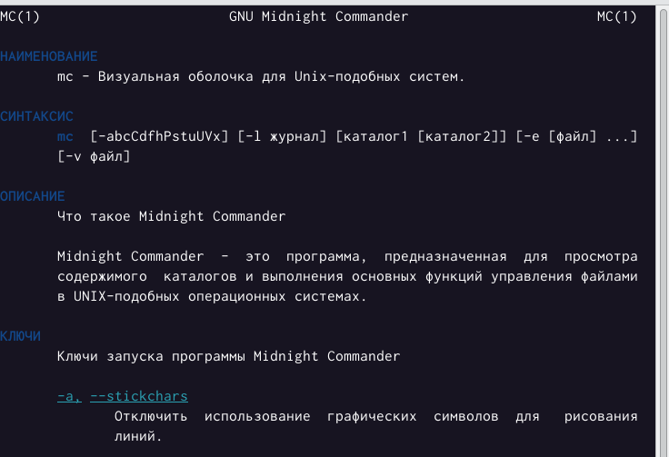{#fig:001 width=90%}

##

2. Запустила из командной строки mc, изучив его структуру и меню.

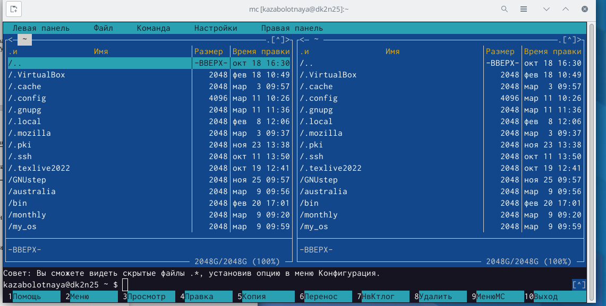{#fig:002 width=90%}

##

3. Выполнила несколько операций в mc, используя управляющие клавиши (операции с панелями; выделение/отмена выделения файлов, копирование/перемещение файлов, получение информации о размере и правах доступа на файлы и/или каталоги и т.п.)

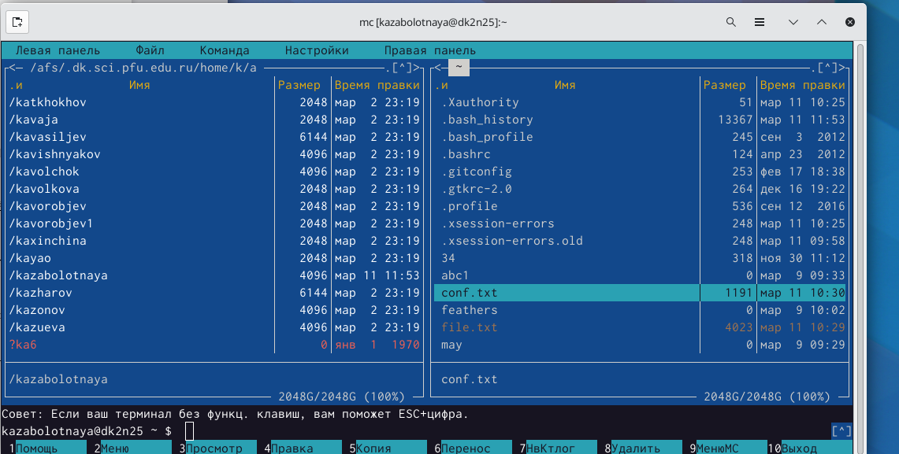{#fig:003 width=90%}

##

{#fig:004 width=90%}

##

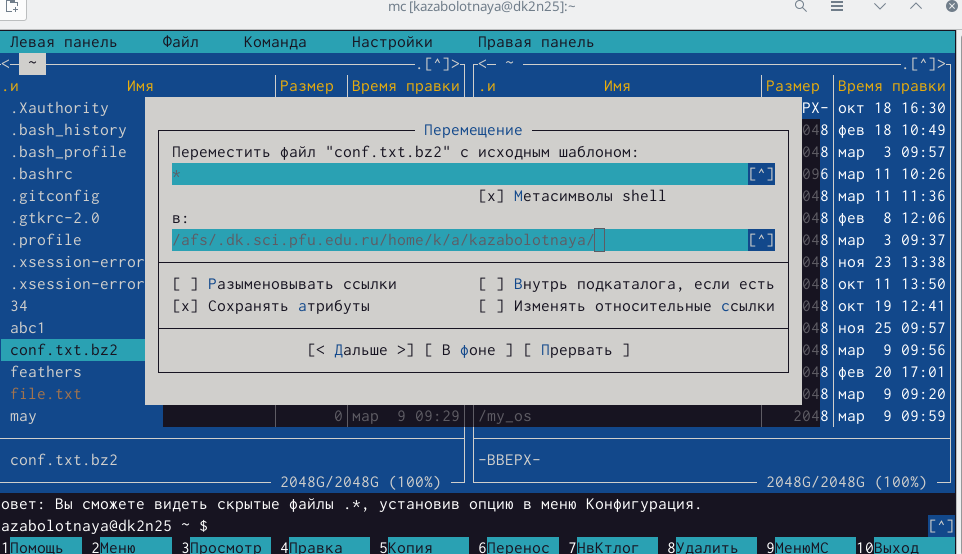{#fig:005 width=90%}

##

{#fig:006 width=90%}

##

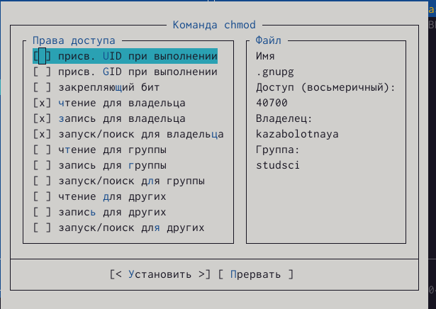{#fig:007 width=90%}

##

4. Выполнила основные команды меню левой (или правой) панели. Оценив степень подробности вывода информации о файлах.

{#fig:008 width=90%}

##

5. Используя возможности подменю Файл, выполнила:
– просмотр содержимого текстового файла:

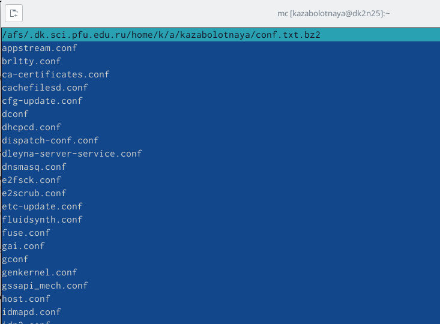{#fig:009 width=90%}

##

– редактирование содержимого текстового файла (без сохранения результатов редактирования)
– создание каталога;
– копирование в файлов в созданный каталог.

{#fig:010 width=90%}

##

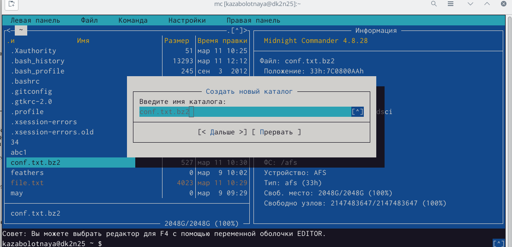{#fig:011 width=90%}

##

{#fig:012 width=90%}

##

6. С помощью соответствующих средств подменю Команда осуществила:
– поиск в файловой системе файла с заданными условиями (например, файла с расширением .c или .cpp, содержащего строку main);
– выбор и повторение одной из предыдущих команд;
– переход в домашний каталог;
– анализ файла меню и файла расширений.

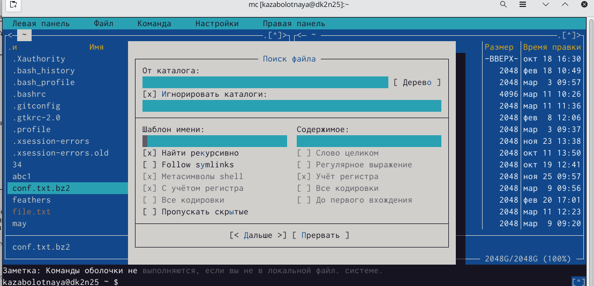{#fig:013 width=90%}

##

{#fig:014 width=90%}

##

{#fig:015 width=90%}

##

{#fig:018 width=90%}

##

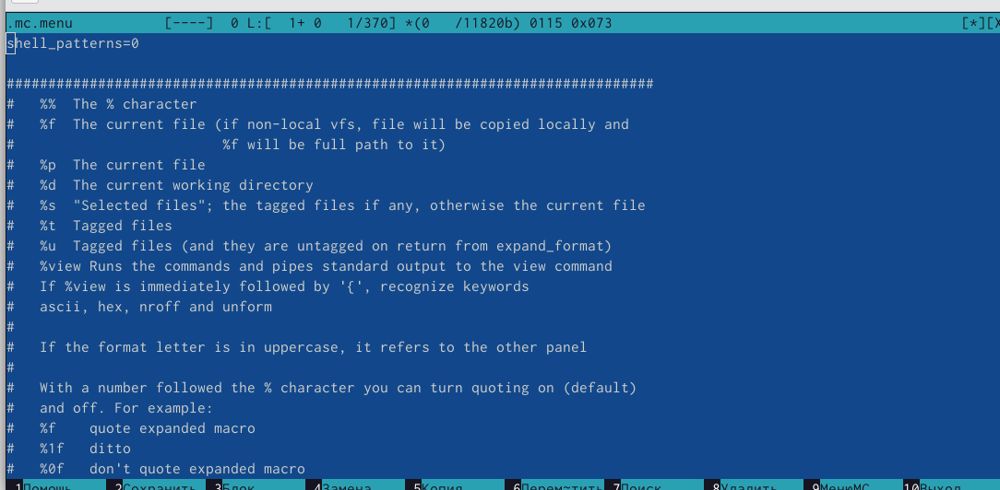{#fig:019 width=90%}

##

7. Вызвала подменю Настройки. Освоила операции, определяющие структуру экрана mc.

{#fig:020 width=90%}

##

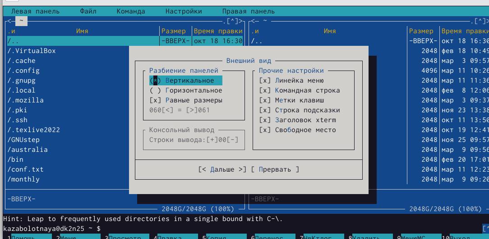{#fig:021 width=90%}

##

8. Создала текстовой файл text.txt.Открыла этот файл с помощью встроенного в mc редактора.

{#fig:022 width=90%}

##

9. Вставила в открытый файл небольшой фрагмент текста, скопированный из Интернета. 

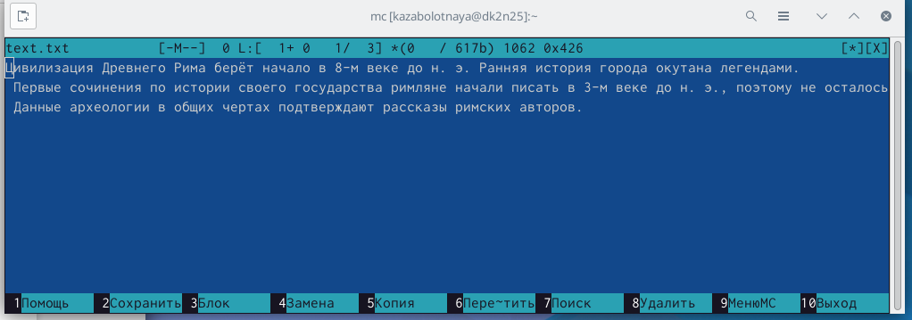{#fig:023 width=90%}

##

10. Проделала с текстом следующие манипуляции, используя горячие клавиши:
4.1. Удалила строку текста.
4.2. Выделила фрагмент текста и скопировала его на новую строку.
4.3. Выделила фрагмент текста и перенесла его на новую строку.
4.4. Сохранила файл.
4.5. Отменила последнее действие.
4.6. Перешла в конец файла (нажав комбинацию клавиш) и написала текст.
4.7. Перешла в начало файла (нажав комбинацию клавиш) и написала текст.
4.8. Сохранила и закрыла файл.

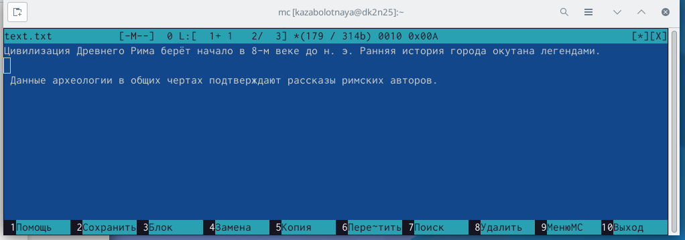{#fig:024 width=90%}

##

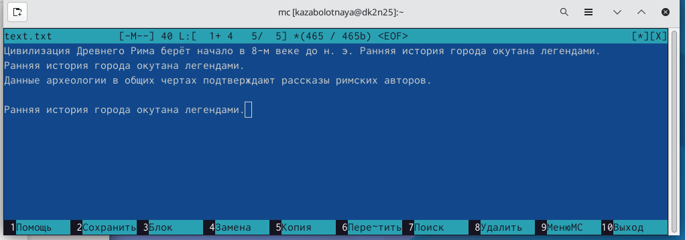{#fig:025 width=90%}

##

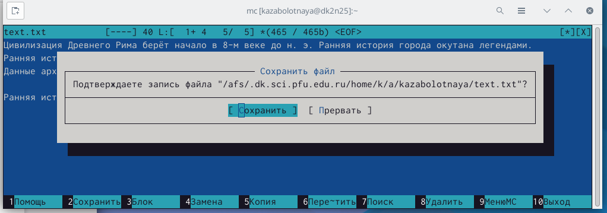{#fig:026 width=90%}

##

{#fig:027 width=90%}

##

11. Открыла файл с исходным текстом в терминале.

{#fig:028 width=90%}

##

12. Используя меню редактора, включила подсветку синтаксиса.

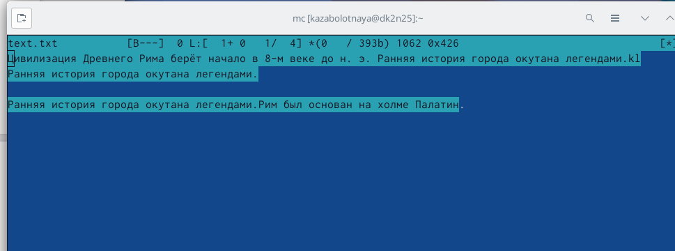{#fig:029 width=90%}

## Итоговый слайд

В ходе выполнения данной лабораторной работы были освоены основные возможности командной оболочки Midnight Commander. Приобретены навыки практической работы по просмотру каталогов и файлов; манипуляций с ними.

