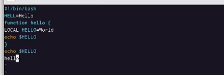
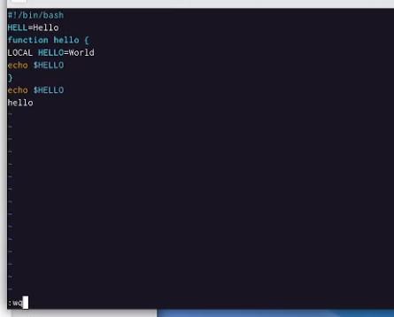
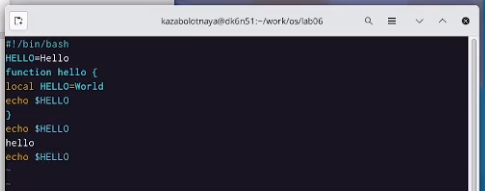

---
## Front matter
lang: ru-RU
title: Лабораторная работа №8
subtitle: Текстовой редактор vi
author:
  - Заболотная Кристина
institute:
  - Российский университет дружбы народов, Москва, Россия

## i18n babel
babel-lang: russian
babel-otherlangs: english

## Formatting pdf
toc: false
toc-title: Содержание
slide_level: 2
aspectratio: 169
section-titles: true
theme: metropolis
header-includes:
 - \metroset{progressbar=frametitle,sectionpage=progressbar,numbering=fraction}
 - '\makeatletter'
 - '\beamer@ignorenonframefalse'
 - '\makeatother'
---

# Информация

## Докладчик

  * Заболотная Кристина Александровна
  * Студент группы НБИбд-01-22
  * Российский университет дружбы народов

## Цели и задачи

Познакомиться с операционной системой Linux. Получить практические навыки работы с редактором vi,  установленным по умолчанию практически во всех дистрибутивах.

## Содержание исследования

1. Первое задание: Создали каталог с именем ~/work/os/lab06, перешли во вновь созданный каталог. Вызвали vi и создали файл hello.sh, при помощи команды - vi hello.sh.

{#fig:001 width=90%}

##

2. Нажали клавишу i и ввели следующий текст:
!/bin/bash
HELL=Hello
function hello {
LOCAL HELLO=World
echo $HELLO
}
echo $HELLO
hello
Нажали клавишу Esc для перехода в командный режим после завершения ввода текста.

{#fig:002 width=90%}

##

3. Нажали : для перехода в режим последней строки и внизу экрана появилось приглашение в виде двоеточия.
Нажали w (записать) и q (выйти), а затем клавишу Enter для сохранения текста и завершения работы.

{#fig:003 width=90%}

##

4. Сделали файл исполняемым.

{#fig:004 width=90%}

##

5. Второе задание: Вызвали vi на редактирование файла.

{#fig:005 width=90%}

##

6. Перешли в режим вставки и заменили слово HELL на HELLO. Esc для возврата в командный режим. Установили курсор на четвертую строку и убрали слово LOCAL. Перешли в режим вставки и наберали следующий текст: local, нажали Esc для возврата в командный режим.

{#fig:006 width=90%}

##

7. Установили курсор на последней строке файла. Вставили после неё строку, содержащую следующий текст: echo $HELLO. Нажали Esc для перехода в командный режим. Удалили последнюю строку. Ввели команду отмены изменений u для отмены последней команды. Введите символ : для перехода в режим последней строки. Записали произведённые изменения и вышли из vi.

{#fig:007 width=90%}

## Итоговый слайд

В ходе выполнения данной лабораторной работы мы познакомились с операционной системой Linux. Получили практические навыки работы с редактором vi, установленным по умолчанию практически во всех дистрибутивах.

