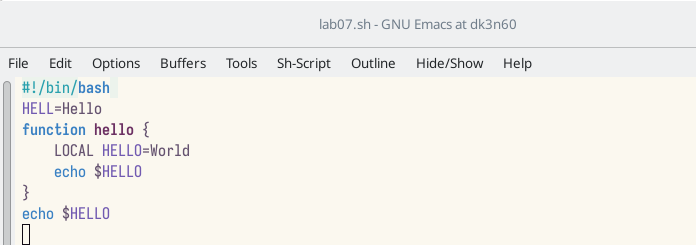
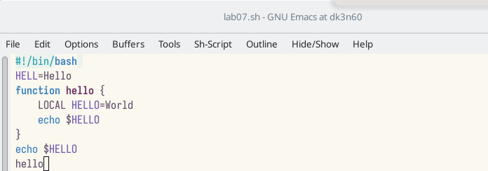
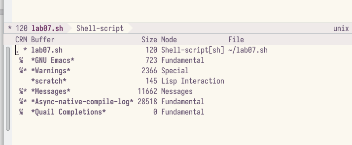
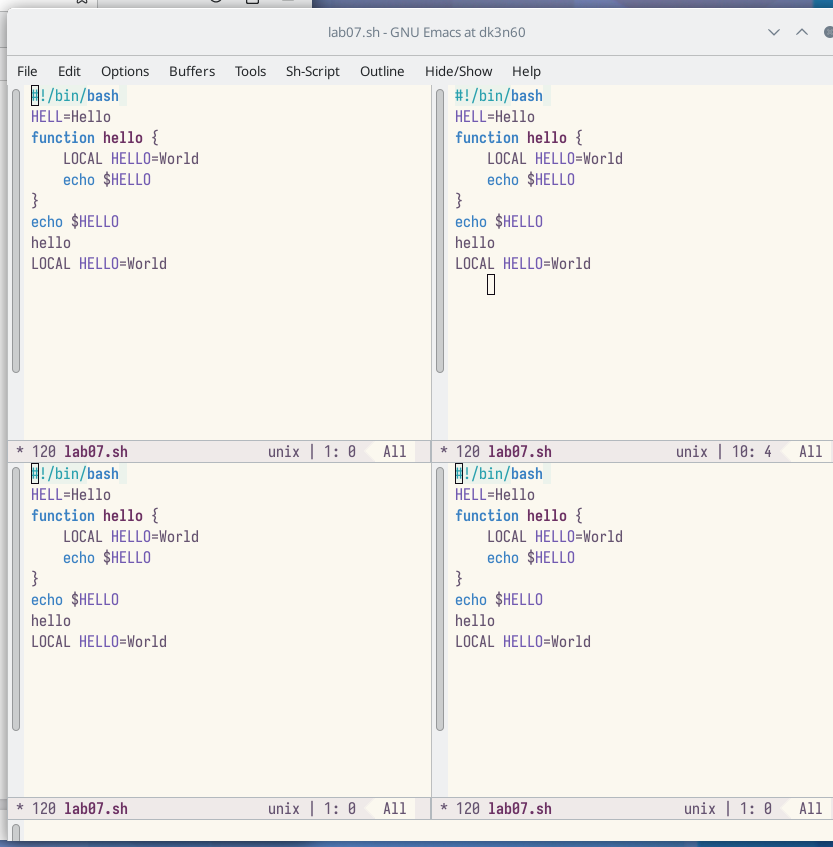
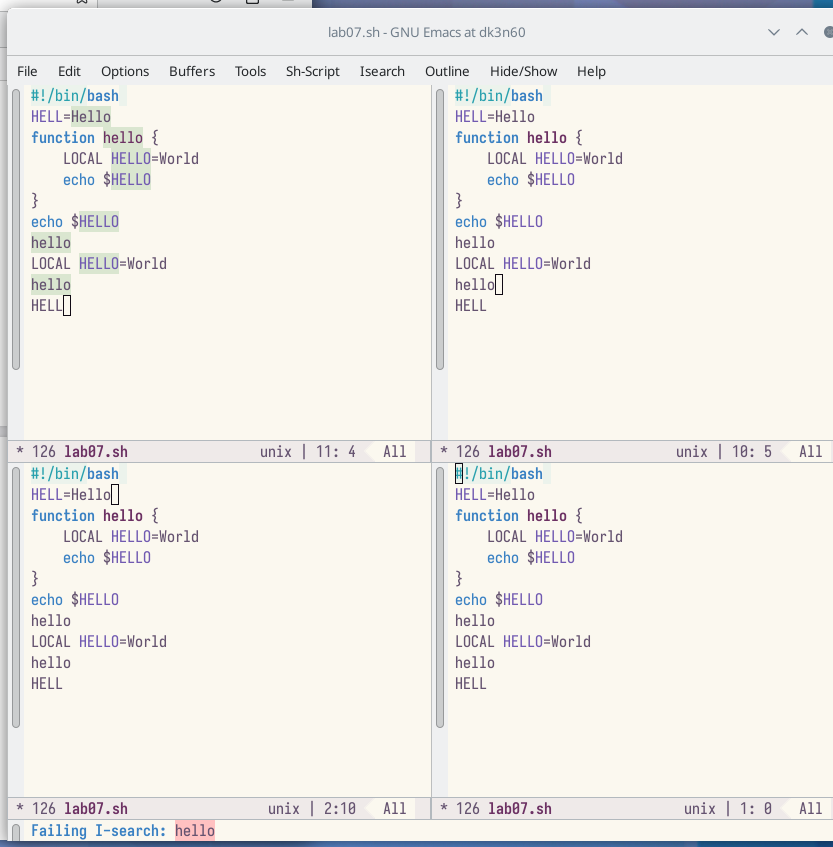
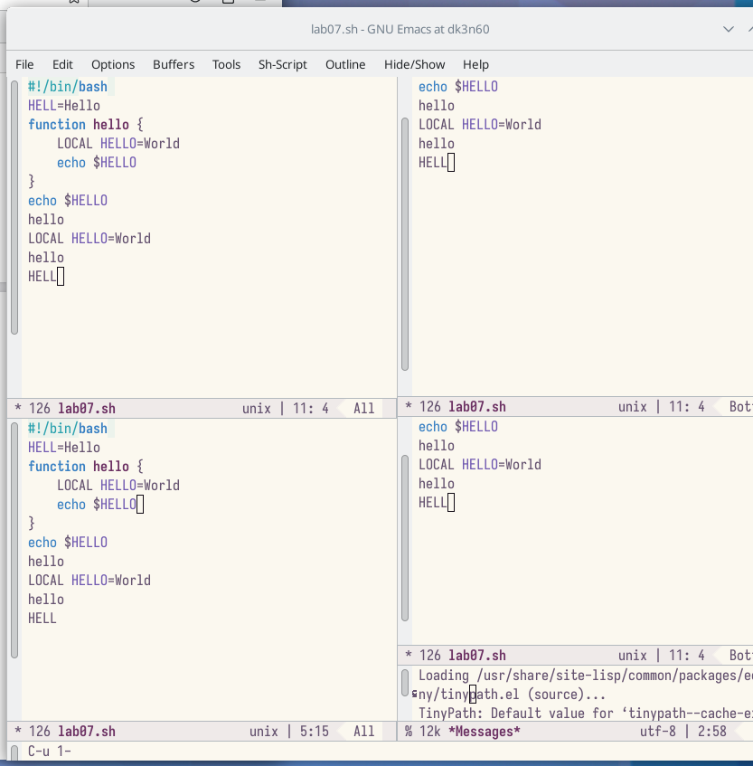

---
## Front matter
lang: ru-RU
title: Лабораторная работа №9
subtitle: Текстовой редактор emacs
author:
  - Заболотная Кристина
institute:
  - Российский университет дружбы народов, Москва, Россия

## i18n babel
babel-lang: russian
babel-otherlangs: english

## Formatting pdf
toc: false
toc-title: Содержание
slide_level: 2
aspectratio: 169
section-titles: true
theme: metropolis
header-includes:
 - \metroset{progressbar=frametitle,sectionpage=progressbar,numbering=fraction}
 - '\makeatletter'
 - '\beamer@ignorenonframefalse'
 - '\makeatother'
---

# Информация

## Докладчик

  * Заболотная Кристина Александровна
  * Студент группы НБИбд-01-22
  * Российский университет дружбы народов

## Цели и задачи

Познакомиться с операционной системой Linux. Получить практические навыки работы с редактором Emacs.

## Содержание исследования

1. Откроем emacs. Создадим файл lab07.sh с помощью комбинации Ctrl-x Ctrl-f (C-x C-f).

{#fig:001 width=90%}

##

{#fig:002 width=90%}

##

2. Наберем текст. Сохраним файл с помощью комбинации Ctrl-x Ctrl-s (C-x C-s).

{#fig:003 width=90%}

##

3. Вырежем одной командой целую строку (С-k).

{#fig:004 width=90%}

##

4. Вставим эту строку в конец файла (C-y).

{#fig:005 width=90%}

##

5. Выделим область текста (C-space). Скопируем область в буфер обмена (M-w). Вставим область в конец файла. Вновь выделим эту область и на этот раз вырежем её (C-w). Отменим последнее действие (C-/). Научились использовать команды по перемещению курсора. Переместили курсор в начало строки (C-a). Переместили курсор в конец строки (C-e). Переместили курсор в начало буфера (M-<).  Переместили курсор в конец буфера (M->).

{#fig:006 width=90%}

##

6. Управление буферами. Выведим список активных буферов на экран (C-x C-b).

{#fig:007 width=90%}

##

7. Закроем это окно (C-x 0). Теперь вновь переключаемся между буферами, но уже без вывода их списка на экран (C-x b).

{#fig:008 width=90%}

##

8. Поделим фрейм на 4 части: разделим фрейм на два окна по вертикали (C-x 3), а затем каждое из этих окон на две части по горизонтали (C-x 2). 

{#fig:009 width=90%}

##

10. В каждом из четырёх созданных окон откроем новый буфер (файл) и введем несколько строк текста.

{#fig:010 width=90%}

##

11. Переключимся в режим поиска (C-s) и найдием несколько слов, присутствующих в тексте.

{#fig:011 width=90%}

##

12. Переключимся между результатами поиска, нажимая C-s.

{#fig:012 width=90%}

##

13. Перейдите в режим поиска и замены (M-%), введите текст, который следует найти и заменить, нажмите Enter , затем введите текст для замены. После того как будут подсвечены результаты поиска, нажмите ! для подтверждения замены.

{#fig:013 width=90%}

## Итоговый слайд

В ходе выполнения данной лабораторной работы мы познакомились с операционной системой Linux. Получили практические навыки работы с редактором Emacs.

