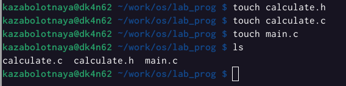
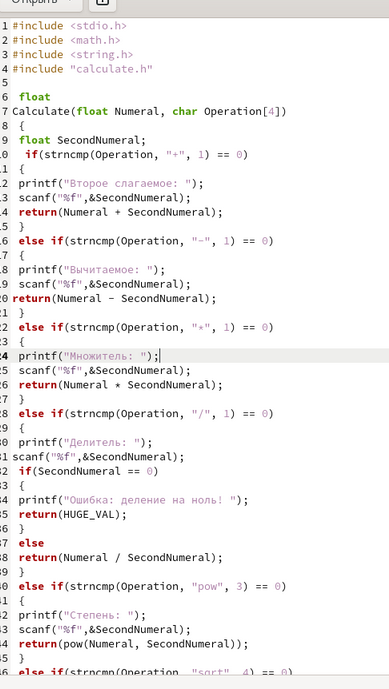
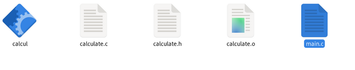
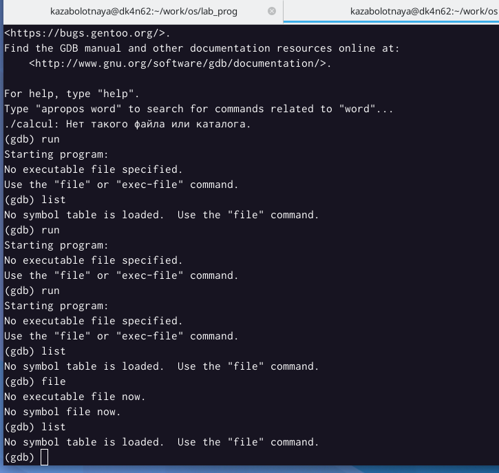

---
## Front matter
lang: ru-RU
title: Лабораторная работа №13
subtitle: Средства, применяемые при разработке программного обеспечения в ОС типа UNIX/Linux
author:
  - Заболотная Кристина
institute:
  - Российский университет дружбы народов, Москва, Россия

## i18n babel
babel-lang: russian
babel-otherlangs: english

## Formatting pdf
toc: false
toc-title: Содержание
slide_level: 2
aspectratio: 169
section-titles: true
theme: metropolis
header-includes:
 - \metroset{progressbar=frametitle,sectionpage=progressbar,numbering=fraction}
 - '\makeatletter'
 - '\beamer@ignorenonframefalse'
 - '\makeatother'
---

# Информация

## Докладчик

  * Заболотная Кристина Александровна
  * Студент группы НБИбд-01-22
  * Российский университет дружбы народов

## Цели и задачи

Приобрести простейшие навыки разработки, анализа, тестирования и отладки приложений в ОС типа UNIX/Linux на примере создания на языке программирования с калькулятора с простейшими функциями.

## Содержание исследования

1. В домашнем каталоге создан подкаталог ~/work/os/lab_prog.

{#fig:001 width=90%}

##

2.  Создайте в нём файлы: calculate.h, calculate.c, main.c. Это будет примитивнейший калькулятор, способный складывать, вычитать, умножать и делить, возводить число в степень, брать квадратный корень, вычислять sin, cos, tan. При запуске он будет запрашивать первое число, операцию, второе число. После этого программа выведет результат и остановится.

{#fig:002 width=90%}

##

Реализация фуекций калькулятора в файлк calculate.c.

{#fig:003 width=90%}

##

Интерфейсный файл calculate.h, описывающий формат вызова функции калькулятора.

{#fig:004 width=90%}

##

Основной файл main.c, реализующий интерфейс пользователя и калькулятора.

{#fig:005 width=90%}

##

3. Выполнена компиляция программы посредством gcc.

{#fig:006 width=90%}

##

{#fig:007 width=90%}

##

4. Исправлены синтаксические ошибки.
5. Создан Makefile.

{#fig:008 width=90%}

##

6. С помощью gdb выполнили отладку программы calcul:
– Запустили отладчик GDB, загрузив в него программу для отладки
– Для запуска программы внутри отладчика ввели команду run
– Для постраничного (по 9 строк) просмотра исходного код использовали команду list
– Для просмотра строк с 12 по 15 основного файла использовали list с параметрами
– Для просмотра определённых строк не основного файла использовали list с параметрами
– Установили точку останова в файле calculate.c на строке номер 21
– Вывели информацию об имеющихся в проекте точка останова
– Запустили программу внутри отладчика и убедились, что программа остановится в момент прохождения точки останова
– Отладчик выдаёт информацию, а команда backtrace показывает весь стек вызываемых функций от начала программы до текущего места.

{#fig:010 width=90%}

##

7. С помощью утилиты splint проанализировали коды файлов calculate.c и main.c.

{#fig:011 width=90%}

## Итоговый слайд

В ходе выполнения данной лабораторной работы мы приобрели простейшие навыки разработки, анализа, тестирования и отладки приложений в ОС типа UNIX/Linux на примере создания на языке программирования с калькулятора с простейшими функциями.

