---
## Front matter
lang: ru-RU
title: Первый этап индивидуального проекта
subtitle: Создание сайта
author:
  - Заболотная Кристина
institute:
  - Российский университет дружбы народов, Москва, Россия

## i18n babel
babel-lang: russian
babel-otherlangs: english

## Formatting pdf
toc: false
toc-title: Содержание
slide_level: 2
aspectratio: 169
section-titles: true
theme: metropolis
header-includes:
 - \metroset{progressbar=frametitle,sectionpage=progressbar,numbering=fraction}
 - '\makeatletter'
 - '\beamer@ignorenonframefalse'
 - '\makeatother'
---

# Информация

## Докладчик

  * Заболотная Кристина Александровна
  * Студент группы НБИбд-01-22
  * Российский университет дружбы народов

## Цели работы

Загрузка шаблона сайта на репозиторий и github. Синхронизация сайта с github.

## Задание

Размещение на github pages заготовки для персонального сайта.
1. Установить необходимое программное обеспечение.
2. Скачать шаблон темы сайта.
3. Разместить его на хостинге git. 
4. Установить параметр для URLs сайта.
5. Разместить заготовку сайта на github pages.

## Содержание исследования

1. Установим необходимое программное устройство. 

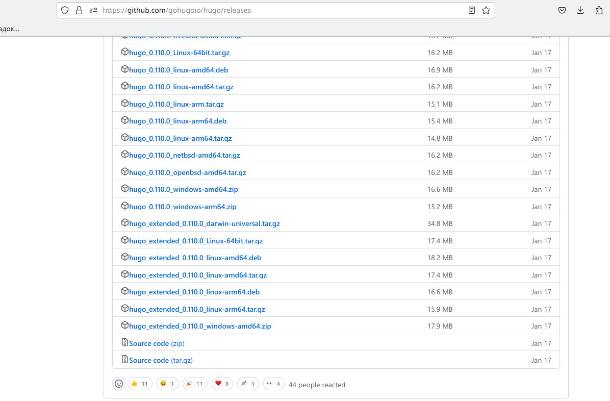{#fig:001 width=90%}

##

2. Создаём репозиторий на github. Клонируем его. Переходим в blog.

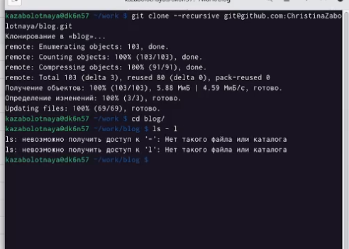{#fig:002 width=90%}

##

3. В blog выполним ~/bin/hugo.

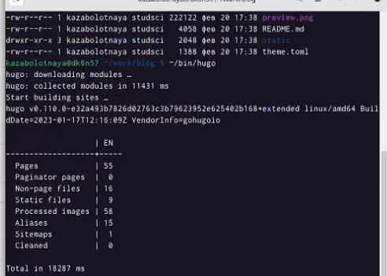{#fig:003 width=90%}

##

4. Удалим папку public, выполним ~/bin/hugo server.

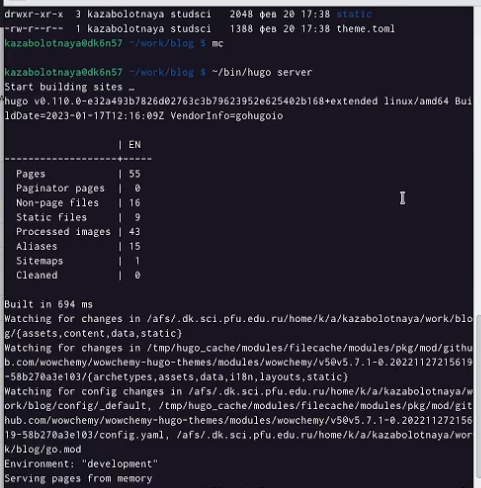{#fig:004 width=90%}

##

5. Создадим репозиторий, со специальным названием, как наш пользователь и .github.io.

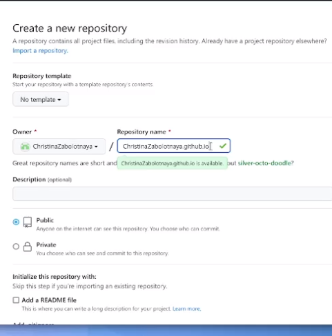{#fig:005 width=90%}

##

6. Перейдём в папку work, клонируем созданный репозиторий, создаём ветку, создаём пустой файл README.md, добавляем этот файл.

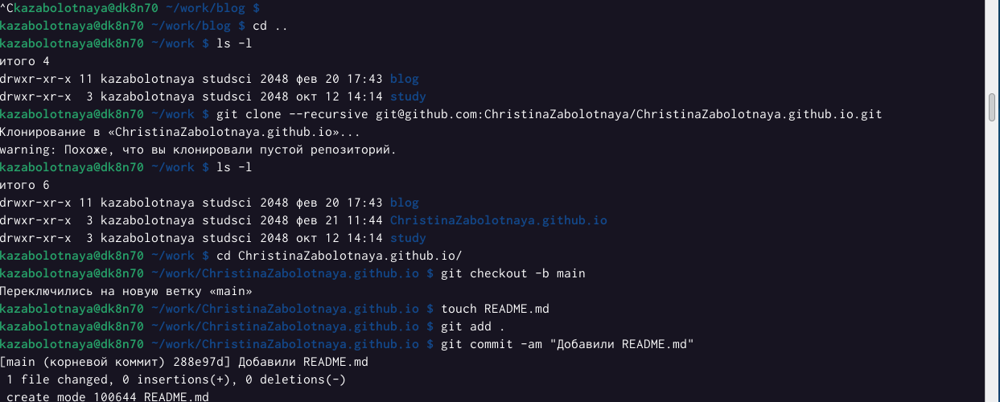{#fig:006 width=90%}

##

7. Переходим в blog, подключим репозиторий к папке, находящейся внутри нашего blog.

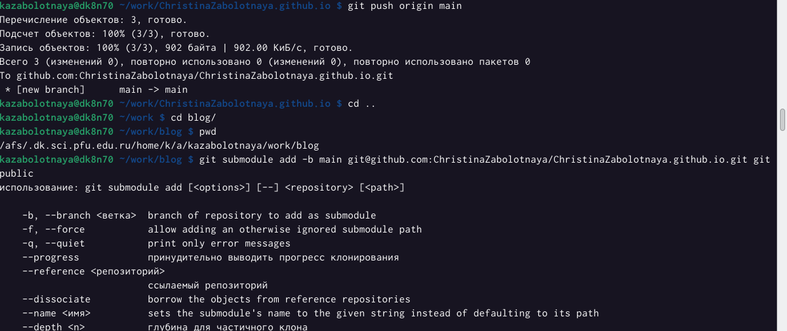{#fig:007 width=90%}

##

8. Комментрируем папку public в gitignore.

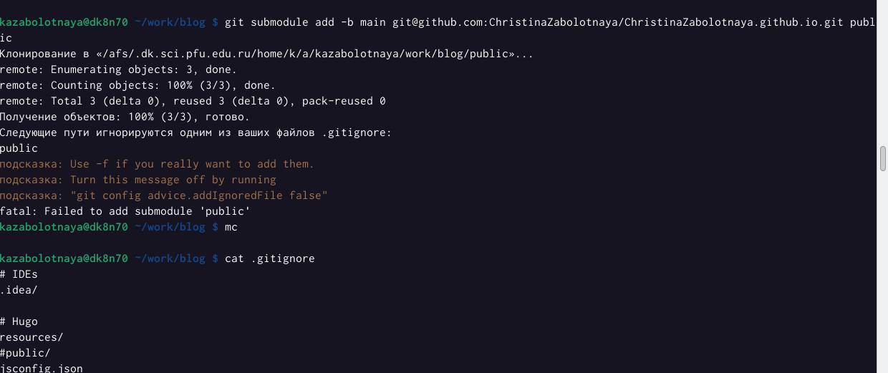{#fig:008 width=90%}

##

9. Перейдём в ~/bin/hugo, далее в папку public, убедимся, что каталог подключен к репозиторию - git remote -v. 

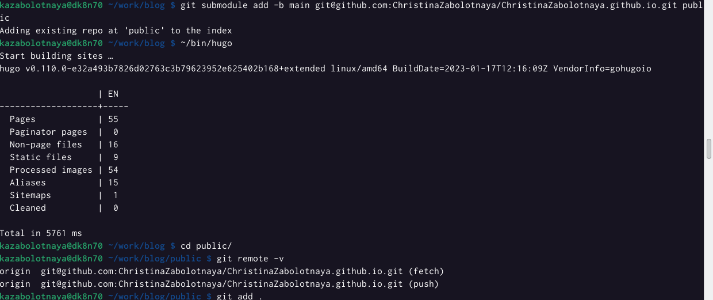{#fig:009 width=90%}

##

10. git add, git commit.

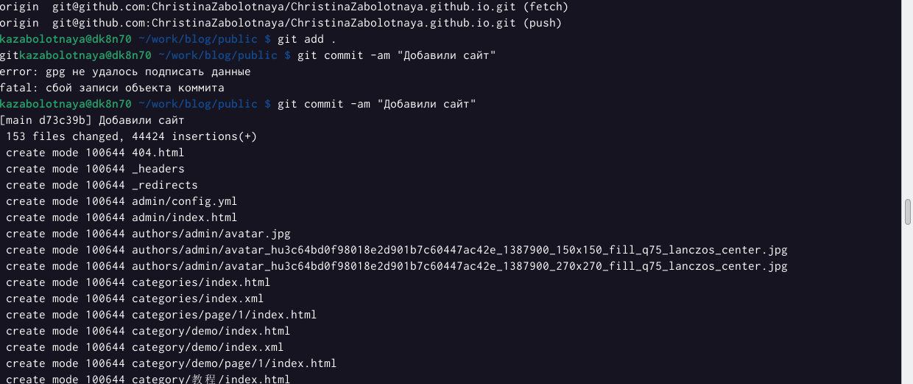{#fig:010 width=90%}

##

11. git push origin main

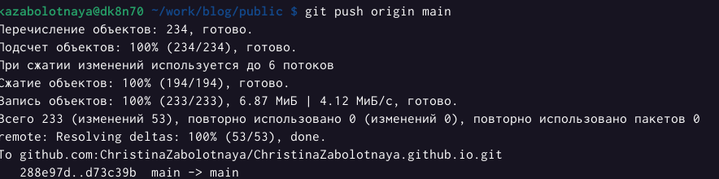{#fig:011 width=90%}

## Итоговый слайд

В ходе выполнения данной лабораторной работы я научилась работать и создавать сайты. Синхронизировать его с github.

