---
## Front matter
title: "Первый этап индивидуального проекта"
subtitle: "Создание сайта"
author: "Заболотная Кристина Александровна"

## Generic otions
lang: ru-RU
toc-title: "Содержание"

## Bibliography
bibliography: bib/cite.bib
csl: pandoc/csl/gost-r-7-0-5-2008-numeric.csl

## Pdf output format
toc: true # Table of contents
toc-depth: 2
lof: true # List of figures
lot: true # List of tables
fontsize: 12pt
linestretch: 1.5
papersize: a4
documentclass: scrreprt
## I18n polyglossia
polyglossia-lang:
  name: russian
  options:
	- spelling=modern
	- babelshorthands=true
polyglossia-otherlangs:
  name: english
## I18n babel
babel-lang: russian
babel-otherlangs: english
## Fonts
mainfont: PT Serif
romanfont: PT Serif
sansfont: PT Sans
monofont: PT Mono
mainfontoptions: Ligatures=TeX
romanfontoptions: Ligatures=TeX
sansfontoptions: Ligatures=TeX,Scale=MatchLowercase
monofontoptions: Scale=MatchLowercase,Scale=0.9
## Biblatex
biblatex: true
biblio-style: "gost-numeric"
biblatexoptions:
  - parentracker=true
  - backend=biber
  - hyperref=auto
  - language=auto
  - autolang=other*
  - citestyle=gost-numeric
## Pandoc-crossref LaTeX customization
figureTitle: "Рис."
tableTitle: "Таблица"
listingTitle: "Листинг"
lofTitle: "Список иллюстраций"
lotTitle: "Список таблиц"
lolTitle: "Листинги"
## Misc options
indent: true
header-includes:
  - \usepackage{indentfirst}
  - \usepackage{float} # keep figures where there are in the text
  - \floatplacement{figure}{H} # keep figures where there are in the text
---

# Цель работы

Загрузка шаблона сайта на репозиторий и github. Синхронизация сайта с github.

# Задание

Размещение на github pages заготовки для персонального сайта.
1. Установить необходимое программное обеспечение.
2. Скачать шаблон темы сайта.
3. Разместить его на хостинге git. 
4. Установить параметр для URLs сайта.
5. Разместить заготовку сайта на github pages.

# Выполнение лабораторной работы

1. Установим необходимое программное устройство. 

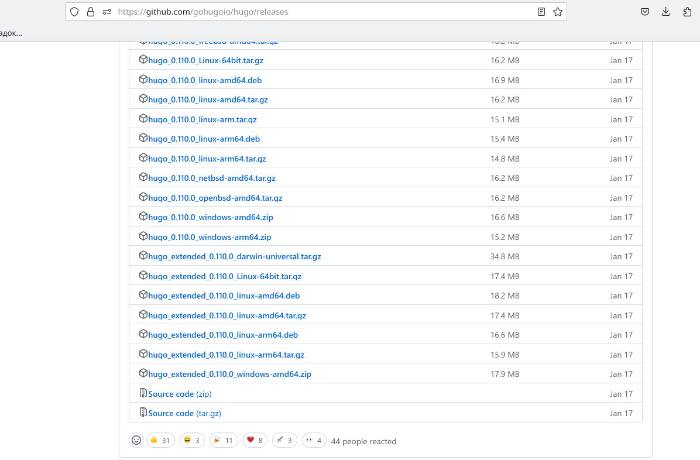{#fig:001 width=90%}

2. Создаём репозиторий на github. Клонируем его. Переходим в blog.

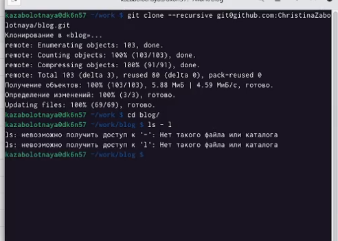{#fig:002 width=90%}

3. В blog выполним ~/bin/hugo.

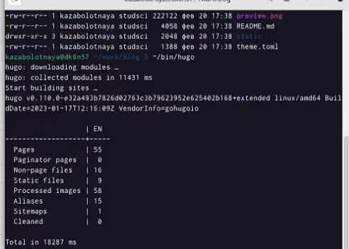{#fig:003 width=90%}

4. Удалим папку public, выполним ~/bin/hugo server.

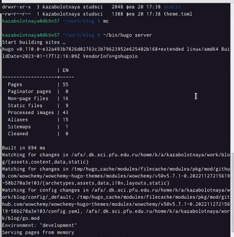{#fig:004 width=90%}

5. Создадим репозиторий, со специальным названием, как наш пользователь и .github.io.

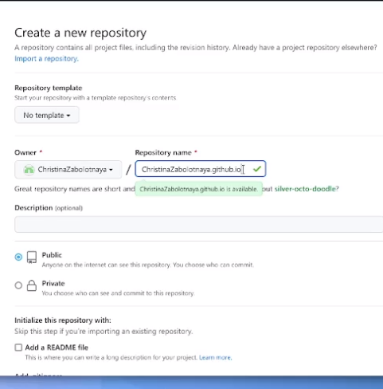{#fig:005 width=90%}

6. Перейдём в папку work, клонируем созданный репозиторий, создаём ветку, создаём пустой файл README.md, добавляем этот файл.

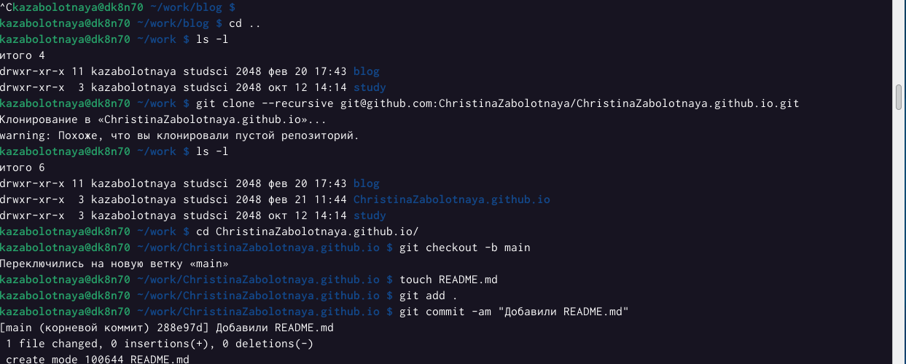{#fig:006 width=90%}

7. Переходим в blog, подключим репозиторий к папке, находящейся внутри нашего blog.

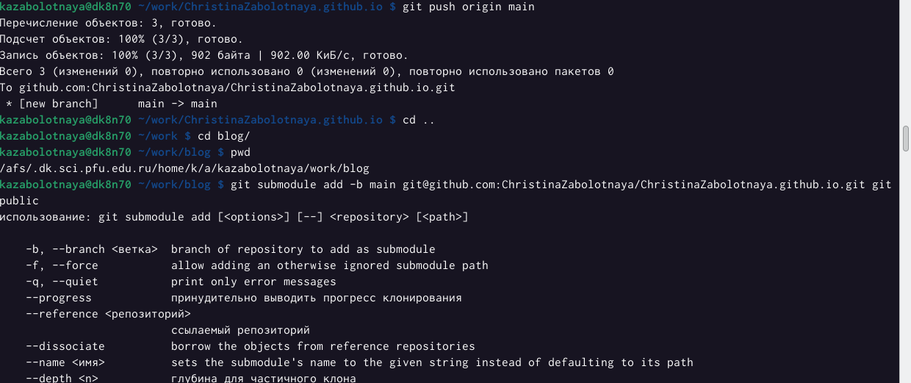{#fig:007 width=90%}

8. Комментрируем папку public в gitignore.

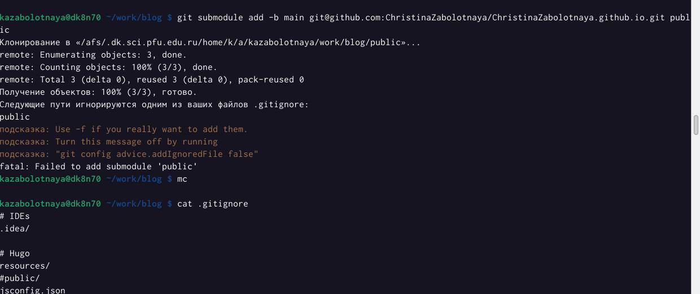{#fig:008 width=90%}

9. Перейдём в ~/bin/hugo, далее в папку public, убедимся, что каталог подключен к репозиторию - git remote -v. 

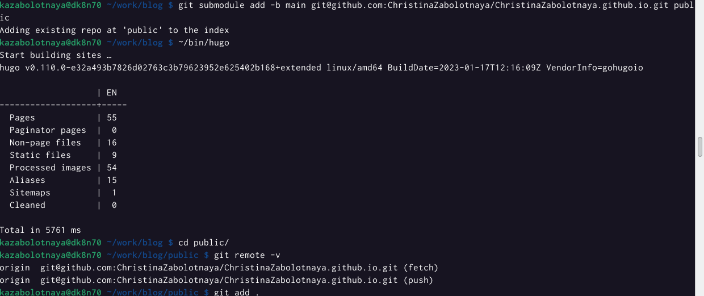{#fig:009 width=90%}

10. git add, git commit.

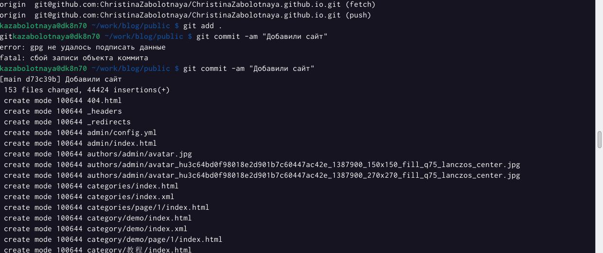{#fig:010 width=90%}

11. git push origin main

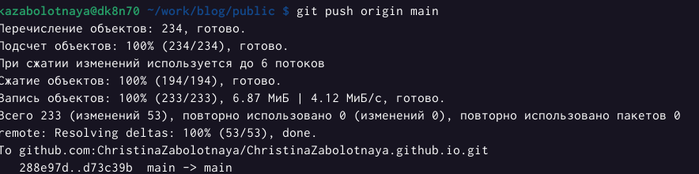{#fig:011 width=90%}

# Выводы

В ходе выполнения данной лабораторной работы я научилась работать и создавать сайты. Синхронизировать его с github.

# Список литературы{.unnumbered}

::: {#refs}
:::
