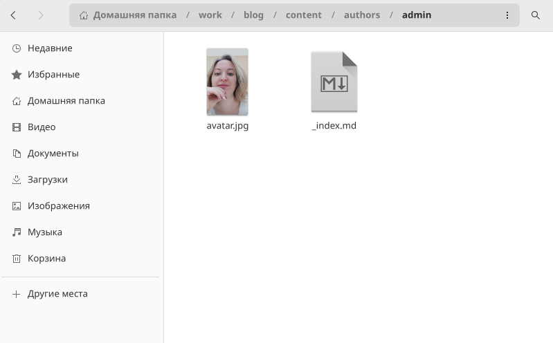
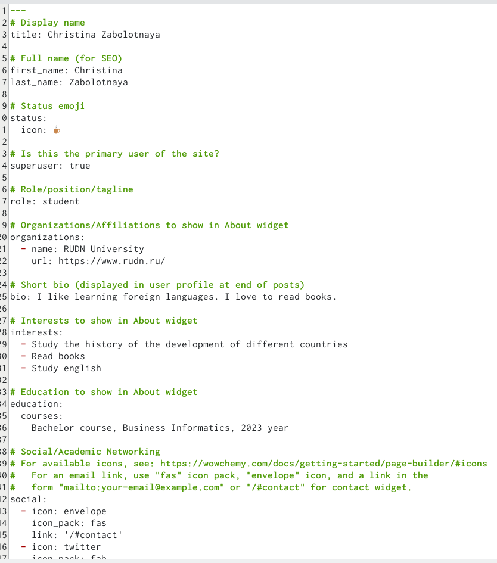
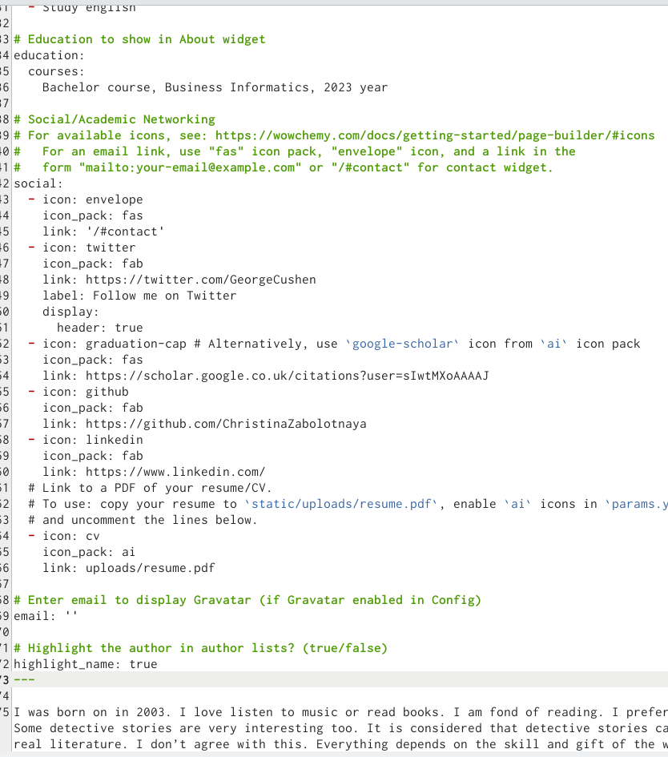
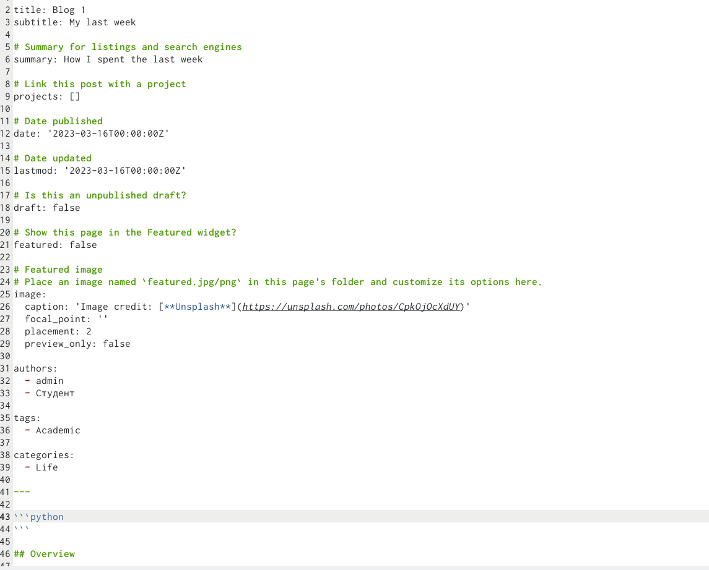
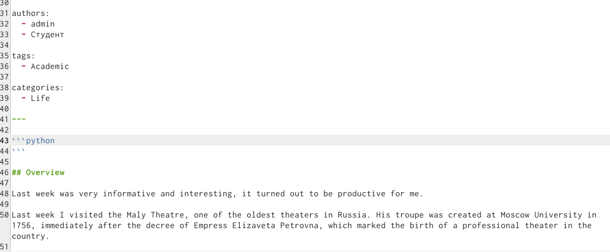
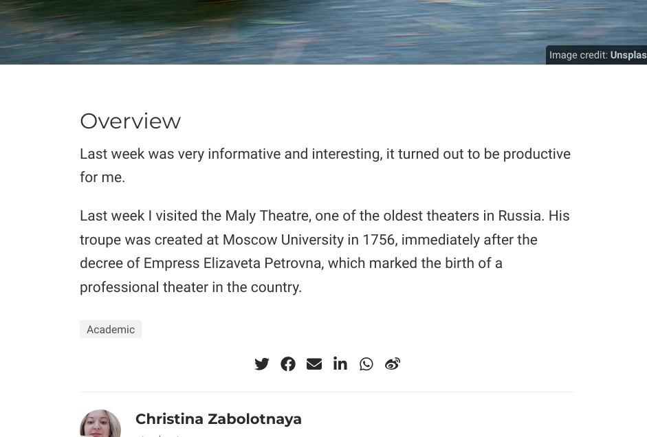
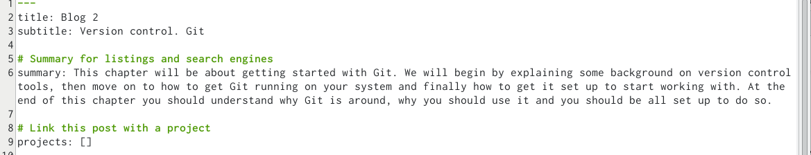
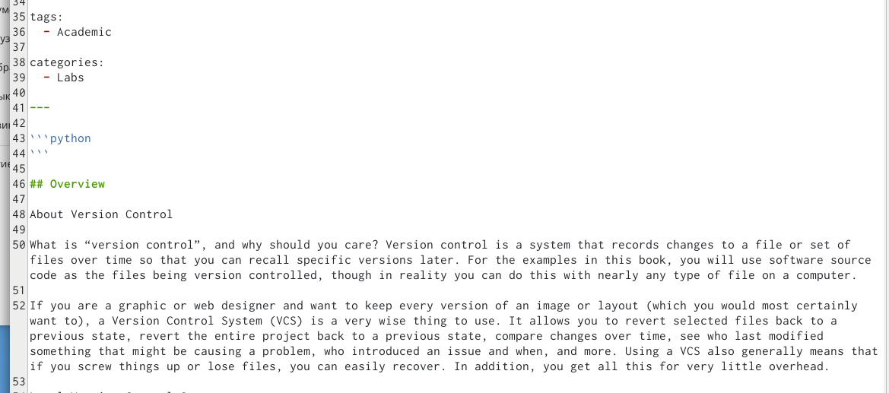
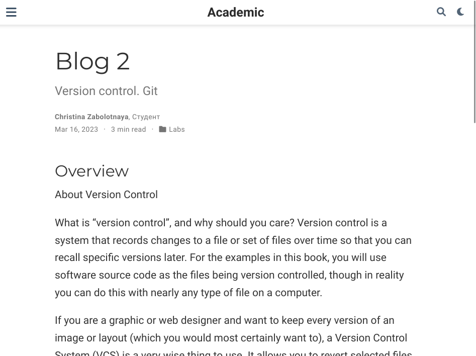
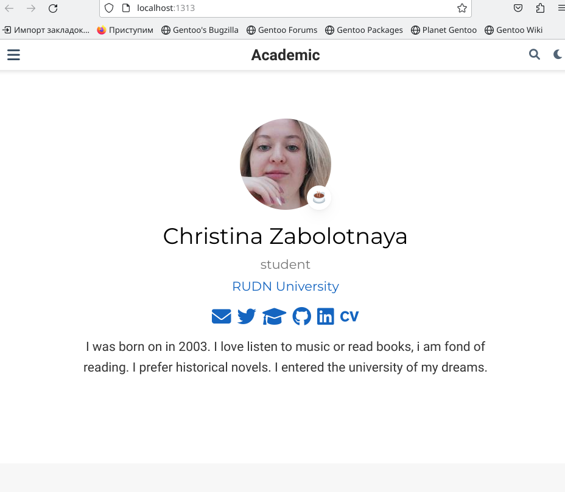

---
## Front matter
lang: ru-RU
title: Второй этап индивидуального проекта
subtitle: Добавление к сайту данных о себе
author:
  - Заболотная Кристина
institute:
  - Российский университет дружбы народов, Москва, Россия

## i18n babel
babel-lang: russian
babel-otherlangs: english

## Formatting pdf
toc: false
toc-title: Содержание
slide_level: 2
aspectratio: 169
section-titles: true
theme: metropolis
header-includes:
 - \metroset{progressbar=frametitle,sectionpage=progressbar,numbering=fraction}
 - '\makeatletter'
 - '\beamer@ignorenonframefalse'
 - '\makeatother'
---

# Информация

## Докладчик

  * Заболотная Кристина Александровна
  * Студент группы НБИбд-01-22
  * Российский университет дружбы народов

## Цели работы

Научиться оформлять сайт, менять информацию о себе и создавать несколько постов.

## Задание

Добавить к сайту данные о себе:

1. Список добавляемых данных.
а) Разместить фотографию владельца сайта.
б) Разместить краткое описание владельца сайта (Biography).
в) Добавить информацию об интересах (Interests).
г) Добавить информацию от образовании (Education).
2. Сделать пост по прошедшей неделе.
3. Добавить пост на тему по выбору:
А) Управление версиями. Git.
Б) Непрерывная интеграция и непрерывное развертывание (CI/CD).
   
   
## Содержание исследования

1. Необходимо добавить на свой сайт личную фотографию, делаю это через файлы в папке blog.

{#fig:001 width=90%}

##

2. Добавляем информацию о себе: своё имя, вуз, краткая биография.

{#fig:002 width=90%}

##

{#fig:003 width=90%}

##

3. Добавляем пост о прошедшей неделе.

{#fig:004 width=90%}

##

{#fig:005 width=90%}

##

{#fig:006 width=90%}

##

4. Добавляем пост по одной из предложенных тем. Я выбрала - управление версиями git.

{#fig:007 width=90%}

##

{#fig:008 width=90%}

##

{#fig:010 width=90%}

##

5. Сам сайт.

{#fig:011 width=90%}

## Итоговый слайд

В ходе выполнения данной лабораторной работы (индивидуального проекта) я научилась оформлять личный сайт, а также создавать посты.

