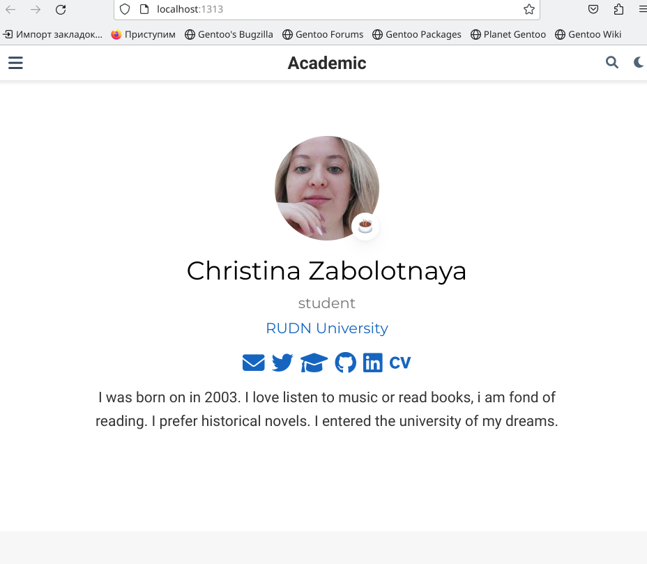

---
## Front matter
title: "Второй этап индивидуального проекта"
subtitle: "Добавление к сайту данных о себе."
author: "Заболотная Кристина Александровна"

## Generic otions
lang: ru-RU
toc-title: "Содержание"

## Bibliography
bibliography: bib/cite.bib
csl: pandoc/csl/gost-r-7-0-5-2008-numeric.csl

## Pdf output format
toc: true # Table of contents
toc-depth: 2
lof: true # List of figures
lot: true # List of tables
fontsize: 12pt
linestretch: 1.5
papersize: a4
documentclass: scrreprt
## I18n polyglossia
polyglossia-lang:
  name: russian
  options:
	- spelling=modern
	- babelshorthands=true
polyglossia-otherlangs:
  name: english
## I18n babel
babel-lang: russian
babel-otherlangs: english
## Fonts
mainfont: PT Serif
romanfont: PT Serif
sansfont: PT Sans
monofont: PT Mono
mainfontoptions: Ligatures=TeX
romanfontoptions: Ligatures=TeX
sansfontoptions: Ligatures=TeX,Scale=MatchLowercase
monofontoptions: Scale=MatchLowercase,Scale=0.9
## Biblatex
biblatex: true
biblio-style: "gost-numeric"
biblatexoptions:
  - parentracker=true
  - backend=biber
  - hyperref=auto
  - language=auto
  - autolang=other*
  - citestyle=gost-numeric
## Pandoc-crossref LaTeX customization
figureTitle: "Рис."
tableTitle: "Таблица"
listingTitle: "Листинг"
lofTitle: "Список иллюстраций"
lotTitle: "Список таблиц"
lolTitle: "Листинги"
## Misc options
indent: true
header-includes:
  - \usepackage{indentfirst}
  - \usepackage{float} # keep figures where there are in the text
  - \floatplacement{figure}{H} # keep figures where there are in the text
---

# Цель работы

Научиться оформлять сайт, менять информацию о себе и создавать несколько постов.

# Задание

Добавить к сайту данные о себе:

1. Список добавляемых данных.
а) Разместить фотографию владельца сайта.
б) Разместить краткое описание владельца сайта (Biography).
в) Добавить информацию об интересах (Interests).
г) Добавить информацию от образовании (Education).
2. Сделать пост по прошедшей неделе.
3. Добавить пост на тему по выбору:
   А) Управление версиями. Git.
   Б) Непрерывная интеграция и непрерывное развертывание (CI/CD).

# Выполнение лабораторной работы

1. Необходимо добавить на свой сайт личную фотографию, делаю это через файлы в папке blog.

{#fig:001 width=90%}

2. Добавляем информацию о себе: своё имя, вуз, краткая биография.

{#fig:002 width=90%}

{#fig:003 width=90%}

3. Добавляем пост о прошедшей неделе.

{#fig:004 width=90%}

{#fig:005 width=90%}

{#fig:006 width=90%}

4. Добавляем пост по одной из предложенных тем. Я выбрала - управление версиями git.

{#fig:007 width=90%}

{#fig:008 width=90%}

{#fig:010 width=90%}

5. Сам сайт.

{#fig:011 width=90%}

# Выводы

В ходе выполнения данной лабораторной работы (индивидуального проекта) я научилась оформлять личный сайт, а также создавать посты.

# Список литературы{.unnumbered}

::: {#refs}
:::
