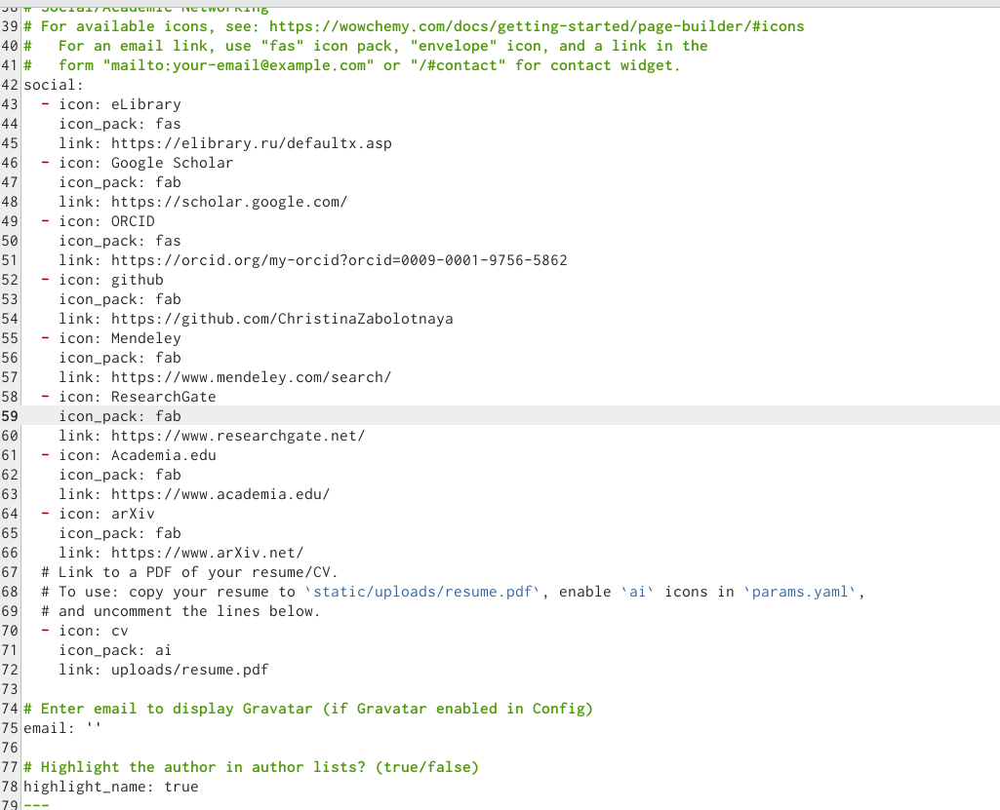
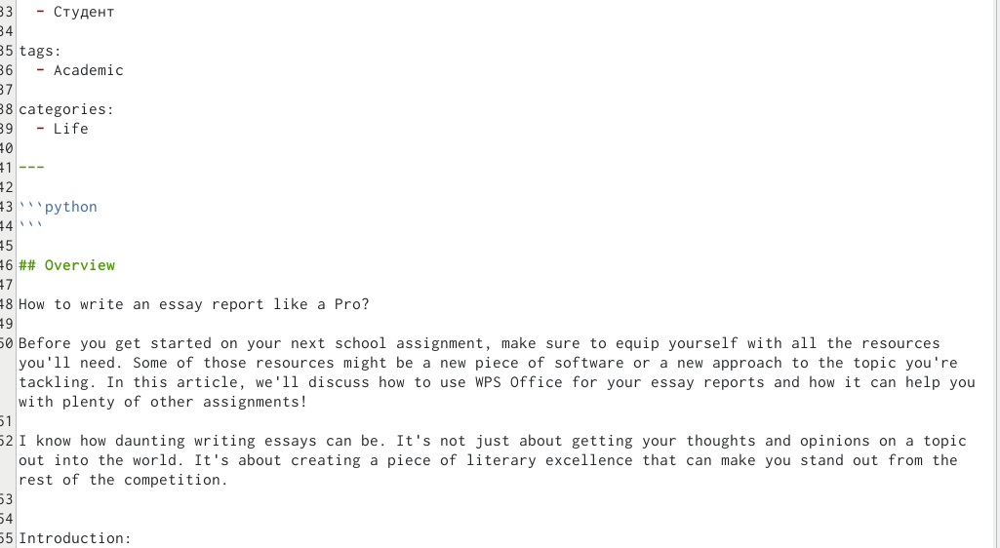
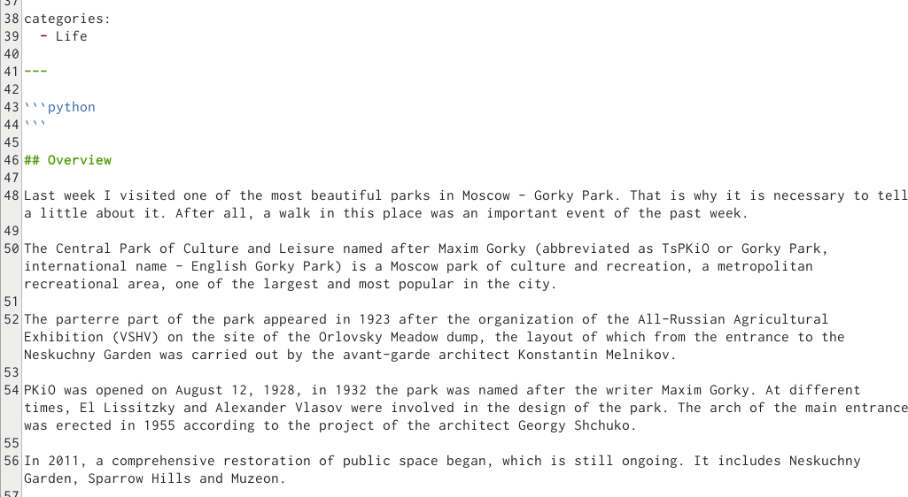
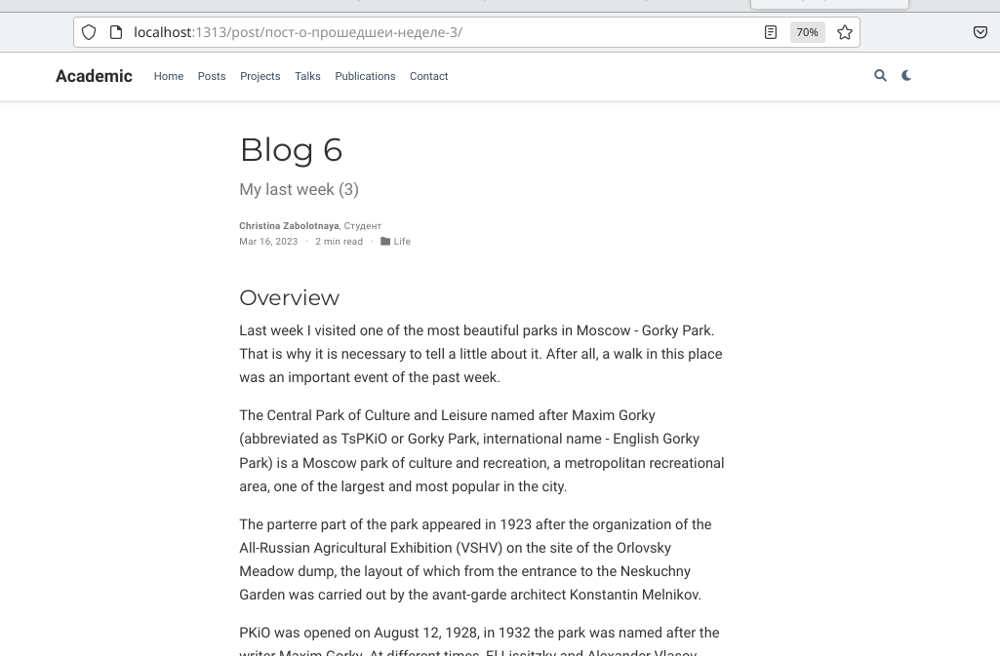

---
## Front matter
lang: ru-RU
title: Четвертый этап индивидуального проекта
subtitle: Добавление к сайту ссылки на научные и библиометрические ресурсы
author:
  - Заболотная Кристина
institute:
  - Российский университет дружбы народов, Москва, Россия

## i18n babel
babel-lang: russian
babel-otherlangs: english

## Formatting pdf
toc: false
toc-title: Содержание
slide_level: 2
aspectratio: 169
section-titles: true
theme: metropolis
header-includes:
 - \metroset{progressbar=frametitle,sectionpage=progressbar,numbering=fraction}
 - '\makeatletter'
 - '\beamer@ignorenonframefalse'
 - '\makeatother'
---

# Информация

## Докладчик

  * Заболотная Кристина Александровна
  * Студент группы НБИбд-01-22
  * Российский университет дружбы народов

## Цели работы

Научиться добавлять к сайту ссылки на научные и библиометрические ресурсы.
 
## Содержание исследования

1. Необходимо добавить к сайту ссылки на научные и библиометрические ресурсы. Зарегистрироваться на соответствующих ресурсах и разместить на них ссылки на сайте. 

{#fig:001 width=90%}

##

2. Добавляем пост на тему по выбору: Оформление отчёта.

{#fig:002 width=90%}

##

{#fig:003 width=90%}

##

3. Добавляем пост по прошедшей неделе.

{#fig:004 width=90%}

##
{#fig:005 width=90%}

## Итоговый слайд

В ходе выполнения данной лабораторной работы (индивидуального проекта) я научилась добавлять к сайту ссылки на научные и библиометрические ресурсы.

