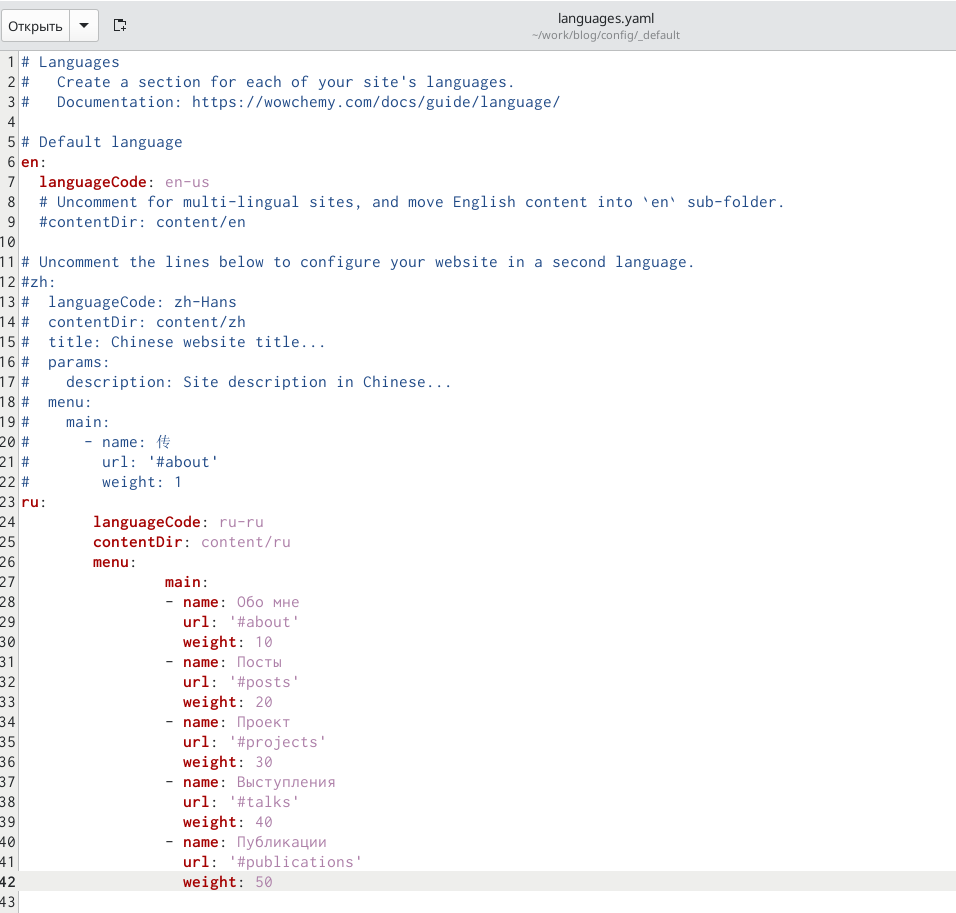
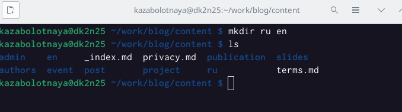
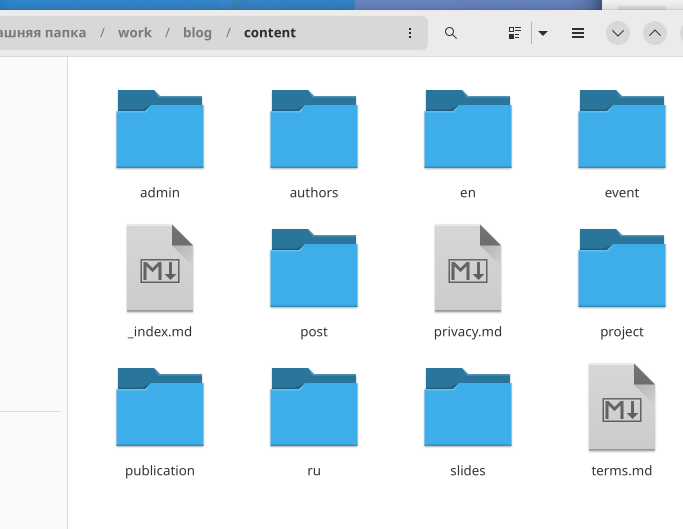
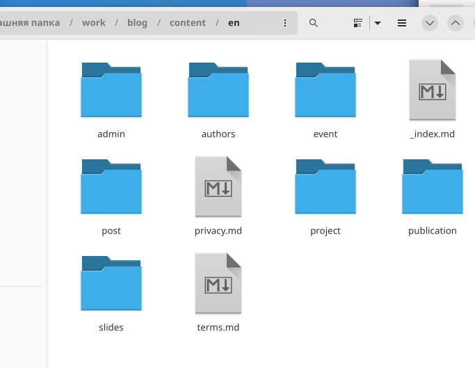
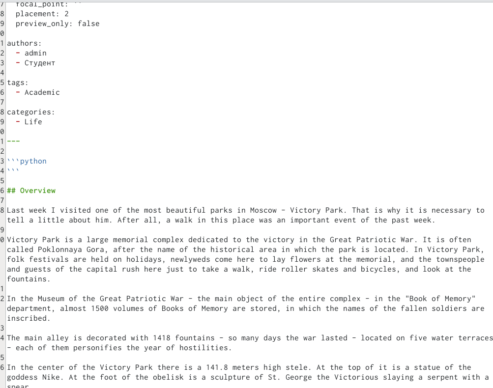

---
## Front matter
lang: ru-RU
title: Шестой этап индивидуального проекта
subtitle: Размещение двуязычного сайта
author:
  - Заболотная Кристина
institute:
  - Российский университет дружбы народов, Москва, Россия

## i18n babel
babel-lang: russian
babel-otherlangs: english

## Formatting pdf
toc: false
toc-title: Содержание
slide_level: 2
aspectratio: 169
section-titles: true
theme: metropolis
header-includes:
 - \metroset{progressbar=frametitle,sectionpage=progressbar,numbering=fraction}
 - '\makeatletter'
 - '\beamer@ignorenonframefalse'
 - '\makeatother'
---

# Информация

## Докладчик

  * Заболотная Кристина Александровна
  * Студент группы НБИбд-01-22
  * Российский университет дружбы народов

## Цели работы

Сделать поддержку английского и русского языков.
 
## Содержание исследования

1. Необходимо сделать поддержку английского и русского языков. Заходим в каталог /blog/config/_default, открываем файл languages. Пишем код для добавления второго языка. 

{#fig:001 width=90%}

##

2. В папке content создаем две папки en и ru. Переносим в созданные папки весь контент. Разместим элементы сайта на обоих языках. Разместим контент на обоих языках.

{#fig:002 width=90%}

##

{#fig:003 width=90%}

##

{#fig:004 width=90%}

##

3. Добавляем пост на тему по выбору. 

{#fig:005 width=90%}

## Итоговый слайд

В ходе выполнения данной лабораторной работы (индивидуального проекта) была сделана поддержка английского и русского языков.

