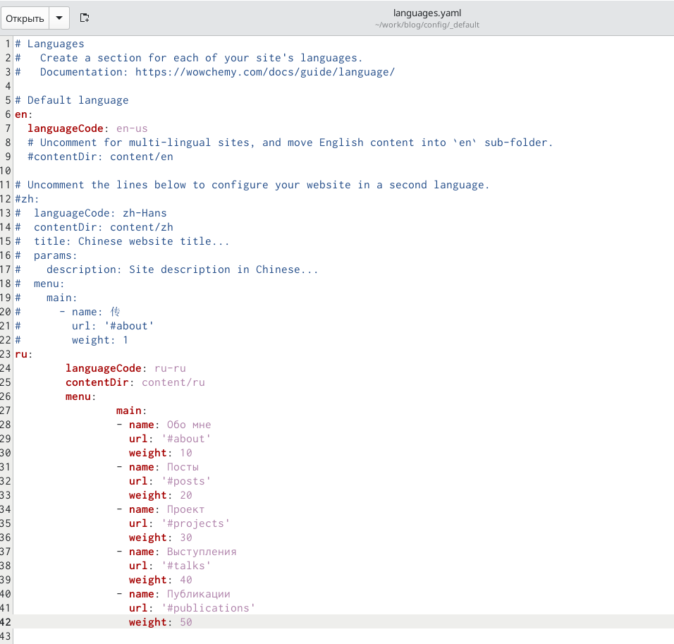
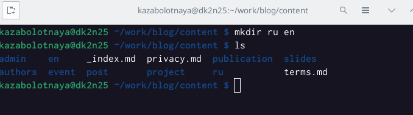
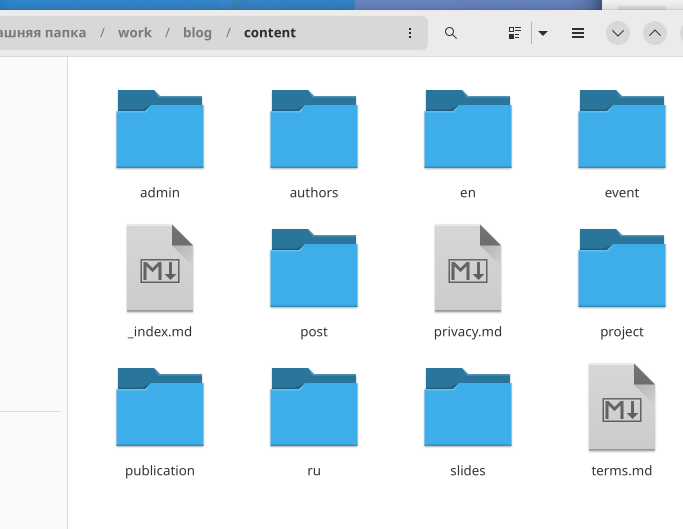
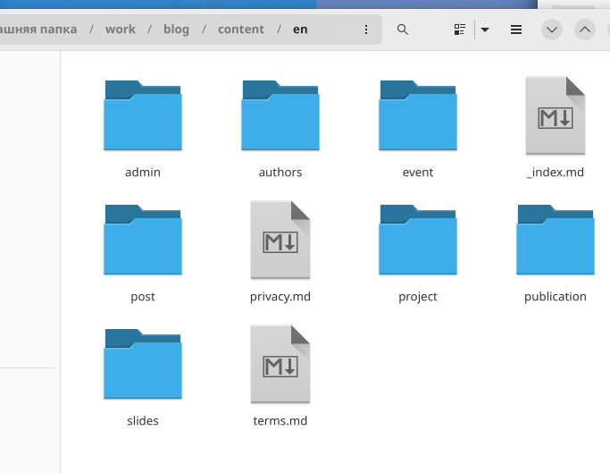
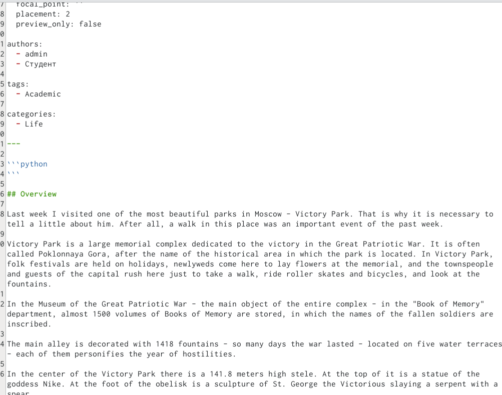

---
## Front matter
title: "Шестой этап индивидуального проекта"
subtitle: "Размещение двуязычного сайта"
author: "Заболотная Кристина Александровна"

## Generic otions
lang: ru-RU
toc-title: "Содержание"

## Bibliography
bibliography: bib/cite.bib
csl: pandoc/csl/gost-r-7-0-5-2008-numeric.csl

## Pdf output format
toc: true # Table of contents
toc-depth: 2
lof: true # List of figures
lot: true # List of tables
fontsize: 12pt
linestretch: 1.5
papersize: a4
documentclass: scrreprt
## I18n polyglossia
polyglossia-lang:
  name: russian
  options:
	- spelling=modern
	- babelshorthands=true
polyglossia-otherlangs:
  name: english
## I18n babel
babel-lang: russian
babel-otherlangs: english
## Fonts
mainfont: PT Serif
romanfont: PT Serif
sansfont: PT Sans
monofont: PT Mono
mainfontoptions: Ligatures=TeX
romanfontoptions: Ligatures=TeX
sansfontoptions: Ligatures=TeX,Scale=MatchLowercase
monofontoptions: Scale=MatchLowercase,Scale=0.9
## Biblatex
biblatex: true
biblio-style: "gost-numeric"
biblatexoptions:
  - parentracker=true
  - backend=biber
  - hyperref=auto
  - language=auto
  - autolang=other*
  - citestyle=gost-numeric
## Pandoc-crossref LaTeX customization
figureTitle: "Рис."
tableTitle: "Таблица"
listingTitle: "Листинг"
lofTitle: "Список иллюстраций"
lotTitle: "Список таблиц"
lolTitle: "Листинги"
## Misc options
indent: true
header-includes:
  - \usepackage{indentfirst}
  - \usepackage{float} # keep figures where there are in the text
  - \floatplacement{figure}{H} # keep figures where there are in the text
---

# Цель работы

Сделать поддержку английского и русского языков.

# Задание

1. Размещение двуязычного сайта на Github:
a) Сделать поддержку английского и русского языков.
б) Разместить элементы сайта на обоих языках.
в) Разместить контент на обоих языках.
г) Сделать пост по прошедшей неделе.
д) Добавить пост на тему по выбору (на двух языках).

# Выполнение лабораторной работы

1. Необходимо сделать поддержку английского и русского языков. Заходим в каталог /blog/config/_default, открываем файл languages. Пишем код для добавления второго языка. 

{#fig:001 width=90%}

2. В папке content создаем две папки en и ru. Переносим в созданные папки весь контент. Разместим элементы сайта на обоих языках. Разместим контент на обоих языках.

{#fig:002 width=90%}

{#fig:003 width=90%}

{#fig:004 width=90%}

3. Добавляем пост на тему по выбору. 

{#fig:005 width=90%}

# Выводы

В ходе выполнения данной лабораторной работы (индивидуального проекта) была сделана поддержка английского и русского языков.

# Список литературы{.unnumbered}

::: {#refs}
:::
